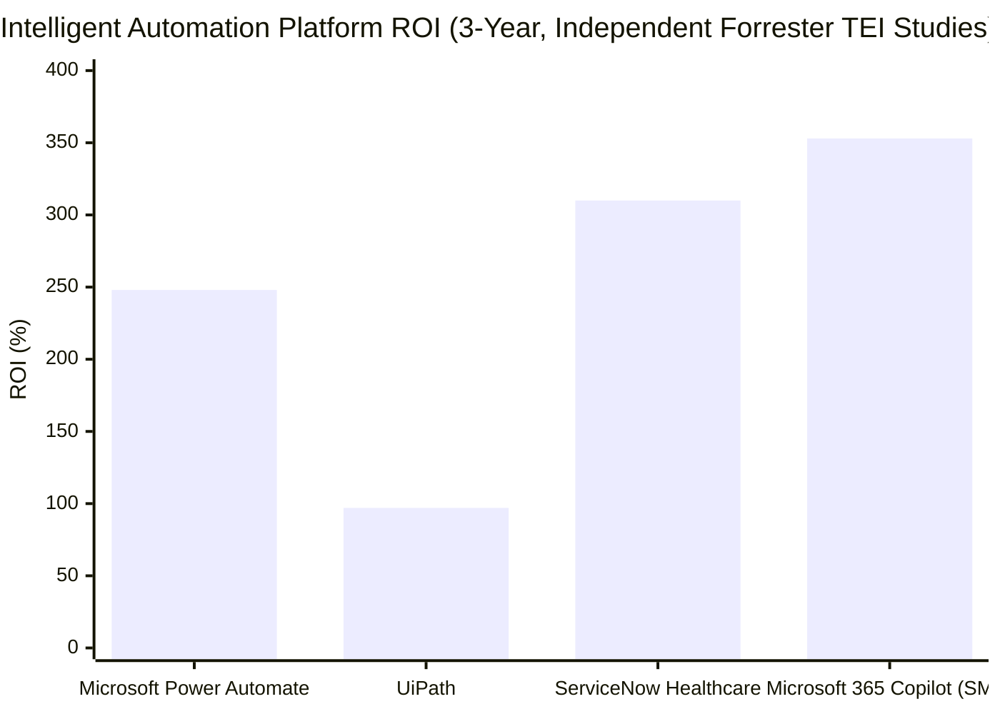

# When the Machine Takes the Monday-Morning Work: How Intelligent Automation Is Delivering on Its Decade-Long Promise

**Version A — With Citations**

---

JPMorgan Chase's legal team once spent 360,000 hours a year reviewing commercial credit agreements (ABA Journal, 2023). That same work is now completed by COiN — a natural language processing system — in a fraction of the time, with a near-zero error rate. It is the kind of outcome that makes intelligent automation's current moment feel different from every prior wave of enterprise technology: the results are specific, documented, and happening at companies that were sceptical just two years ago.

## The Shift from Experiment to Execution

The numbers from 2025 are not projections. According to McKinsey's State of AI report (McKinsey & Company, 2025), 88% of organisations now use AI in at least one business function — up from 78% the year before. More telling is what sits beneath that figure: only 39% report measurable earnings impact, and a mere 6% qualify as genuine high performers, defined as organisations attributing more than 5% EBIT improvement to AI. The gap between those two groups is not a capability gap. It is an execution gap.

The organisations in the 6% share a documented pattern: they did not layer automation onto existing workflows. They redesigned the workflows. Accenture's 2024 research found that companies with fully AI-led processes achieve 2.5 times higher revenue growth and 2.4 times greater productivity than peers — but only 16% of companies had reached that state by 2024, up from 9% in 2023 (Accenture, 2024).

## Five Industries, One Pattern: Replace the Manual, Redirect the Human

**Financial services** has moved from proof-of-concept to embedded infrastructure. Wells Fargo's Fargo virtual assistant — upgraded in 2025 with Google Gemini 2.0 Flash — handled 245 million customer interactions in 2024 alone, up from 21.3 million in 2023 (VentureBeat, 2025). BBVA deployed ChatGPT Enterprise to all 120,000 employees and watched its legal division automate 9,000+ routine queries per year, freeing three full-time equivalents who now produce 11,000 documents annually rather than answering rote questions (OpenAI, 2025). The productivity gain is not theoretical — it is measured at 2.8 hours per employee per week across the bank's workforce.

**Insurance** had a structural problem: claims processing was linear, manual, and slow by design. Allianz dismantled that design. In Germany, its first agentic AI deployment — launched in November 2025 — now fully processes 49.7% of pet insurance claims with no human intervention, with simple claims paid within hours rather than days (Allianz Media Centre, 2025). In Australia, Project Nemo cut food spoilage claims under AUD 500 from seven days to under one day. Separately, Allianz's fraud detection system achieved a 29% increase in fraud identification rates. These are not the same company in the same country — they are three different programmes, all delivering simultaneously.

**Manufacturing** was the sector most resistant to simple automation given the physical complexity of production environments. Siemens answered that with Industrial Copilot, built on Microsoft Azure OpenAI Service and now deployed to over 100 enterprise customers. Engineers at Thyssenkrupp Automation Engineering — previously spending multiple days on panel visualisation creation — now complete the same task in 30 seconds (Siemens Press, 2025). Generated automation code requires only 20% adaptation by a human engineer. A parallel pilot demonstrated a 25% reduction in reactive maintenance time.

**Logistics** has always been a data problem masquerading as a physical one. UPS solved it with ORION, a machine learning route optimisation system that eliminates 100 million delivery miles per year — the equivalent of saving 10 million gallons of fuel annually and generating approximately USD 300–400 million in cost savings (multiple logistics sources). DHL committed USD 700 million to AI-enabled supply chain orchestration in 2024, achieving a 35% productivity increase and 99.7% order accuracy across automated facilities (DHL, 2024). Walmart's Self-Healing Inventory system — using agentic AI to identify and correct inventory discrepancies without human intervention — has saved USD 55 million (Logistics Viewpoints, 2025).

**Healthcare** has the highest operational cost of any sector and the lowest tolerance for error. Mayo Clinic deployed 34 virtual workers to manage revenue cycle tasks — claims submission, coding, denial management — that were previously handled entirely by human staff. Cleveland Clinic integrated Aidoc's DeepCertainty algorithms into radiology workflows, applying AI-assisted detection for fractures, lung nodules, and strokes at a scale that individual radiologists could not sustain. Prudential's MedScreen Plus underwriting tool, built on Google's MedLM model, improved underwriting speed by 50% in Hong Kong (Computer Weekly, 2025).

## The Returns Are Real — But So Are the Failure Rates

Forrester's 2024 Total Economic Impact study of Microsoft Power Automate, based on a composite of enterprise deployments, found a three-year ROI of 248%, an NPV of USD 39.85 million, and a payback period of under six months (Forrester/Microsoft, 2024). UiPath's equivalent study returned 97% ROI. These are independent, commissioned studies — not vendor claims — and they reflect the economics of businesses that implemented well.

The inverse is equally documented. MIT research reported by Fortune in August 2025 found that 95% of enterprise generative AI pilots fail to deliver measurable P&L impact. The failure modes are consistent: fragmented data, integration complexity with legacy systems, and absent governance frameworks. HFS Research estimates the Global 2000 carry USD 1.5–2 trillion in accumulated technical debt — the single largest structural barrier to AI realising its returns (HFS Research/Publicis Sapient, 2025). Gartner, meanwhile, predicts that over 40% of agentic AI projects will be cancelled by the end of 2027 due to escalating costs and unclear business value (Gartner, June 2025).

The defining variable between the companies achieving documented ROI and those abandoning pilots is not the technology. It is whether the organisation treated automation as an infrastructure decision — requiring governance, data quality investment, and workflow redesign — rather than a software purchase.

## What Happens Next

PwC's 2025 Global AI Jobs Barometer found that productivity growth in AI-exposed industries — financial services and software publishing in particular — nearly quadrupled from 7% (2018–2022) to 27% (2018–2024) (PwC, 2025). That rate of productivity acceleration has no recent precedent. KPMG's Q4 2025 AI Pulse survey found that enterprise AI investment climbed from an average of USD 114 million in Q1 2025 to USD 130 million by Q3, while the proportion of enterprises deploying AI agents more than doubled — from 11% to 26% — in the same period (KPMG, 2025).

The organisations now extracting documented value from intelligent automation are not waiting to see whether it works. They proved it works, and they are accelerating. For their competitors, the relevant question is no longer whether to automate — it is whether the data infrastructure, governance frameworks, and workflow redesign capability are in place to do it in a way that creates the 248% ROI rather than the abandoned pilot.

*Source: Forrester Consulting TEI studies commissioned by Microsoft (2024), UiPath (2024), and ServiceNow (2024/2025). ServiceNow figure from healthcare provider composite. Copilot SMB figure from Microsoft 365 Blog (2024).*

---

## References

Accenture. (2024). *New Accenture research finds that companies with AI-led processes outperform peers*. Accenture Newsroom. https://newsroom.accenture.com/news/2024/new-accenture-research-finds-that-companies-with-ai-led-processes-outperform-peers

ABA Journal. (2023). *JPMorgan Chase uses tech to save 360,000 hours of annual work*. https://www.abajournal.com/news/article/jpmorgan_chase_uses_tech_to_save_360000_hours_of_annual_work_by_lawyers_and

Allianz Group. (2025, February 5). *Smarter claims management, smoother settlements*. Allianz Media Centre. https://www.allianz.com/en/mediacenter/news/articles/250205-smarter-claims-management-smoother-settlements.html

Allianz Group. (2025, November 3). *Allianz launched its first agentic AI to automate claims*. Allianz Media Centre. https://www.allianz.com/en/mediacenter/news/articles/251103-when-the-storm-clears-so-should-the-claim-queue.html

DHL. (2024). *DHL supply chain continues to innovate with orchestration, robotics, and AI in 2024*. DHL Press Archive. https://www.dhl.com/us-en/home/press/press-archive/2024/dhl-supply-chain-continues-to-innovate-with-orchestration-robotics-and-ai-in-2024.html

Forrester Consulting. (2024, July). *The total economic impact™ of Microsoft Power Automate*. Commissioned by Microsoft. https://info.microsoft.com/ww-landing-2024-The-Total-Economic-Impact-of-Power-Platform.html

Forrester Consulting. (2024). *The total economic impact™ of UiPath automation*. Commissioned by UiPath. https://roboticsai.co.uk/wp-content/uploads/2024/02/Forrester-The-Total-Economic-Impact%E2%84%A2-of-UiPath-Automation-Report-1.pdf

Gartner. (2024, September 18). *Gartner says 30% of enterprises will automate more than half of their network activities by 2026*. Gartner Newsroom. https://www.gartner.com/en/newsroom/press-releases/2024-09-18-gartner-says-30-percent-of-enterprises-will-automate-more-than-half-of-their-network-activities-by-2026

Gartner. (2025, June 25). *Gartner predicts over 40% of agentic AI projects will be canceled by end of 2027*. Gartner Newsroom. https://www.gartner.com/en/newsroom/press-releases/2025-06-25-gartner-predicts-over-40-percent-of-agentic-ai-projects-will-be-canceled-by-end-of-2027

HFS Research & Publicis Sapient. (2025, May). *Smash through tech debt: Why AI is the jackhammer*. https://www.publicissapient.com/resources/research/hfs-ai-tech-debt

KPMG US. (2025, Q4). *AI at scale: How 2025 set the stage for agent-driven enterprise reinvention in 2026*. https://kpmg.com/us/en/media/news/q4-ai-pulse.html

Logistics Viewpoints. (2025, March 19). *Walmart and the new supply chain reality: AI, automation, and resilience*. https://logisticsviewpoints.com/2025/03/19/walmart-and-the-new-supply-chain-reality-ai-automation-and-resilience/

McKinsey & Company. (2025, November). *The state of AI in 2025: Agents, innovation, and transformation*. McKinsey QuantumBlack. https://www.mckinsey.com/capabilities/quantumblack/our-insights/the-state-of-ai

MIT study as reported by Fortune. (2025, August 18). *MIT report: 95% of generative AI pilots at companies are failing*. Fortune. https://fortune.com/2025/08/18/mit-report-95-percent-generative-ai-pilots-at-companies-failing-cfo/

OpenAI. (2025). *From pilot to practice: How BBVA is scaling AI across the organisation*. OpenAI Customer Stories. https://openai.com/index/bbva-2025/

PwC. (2025, June). *2025 global AI jobs barometer*. https://www.pwchk.com/en/press-room/press-releases/pr-130625.html

Prudential. (2025). *Prudential taps AI to improve health insurance experience*. Computer Weekly. https://www.computerweekly.com/news/366614496/Prudential-taps-AI-to-improve-health-insurance-experience

Siemens AG. (2025). *Siemens expands Industrial Copilot with new generative AI-powered maintenance offering*. Siemens Press. https://press.siemens.com/global/en/pressrelease/siemens-expands-industrial-copilot-new-generative-ai-powered-maintenance-offering

VentureBeat. (2025). *Wells Fargo's AI assistant just crossed 245 million interactions*. https://venturebeat.com/ai/wells-fargos-ai-assistant-just-crossed-245-million-interactions-with-zero-humans-in-the-loop-and-zero-pii-to-the-llm

---

# When the Machine Takes the Monday-Morning Work: How Intelligent Automation Is Delivering on Its Decade-Long Promise

**Version B — Without In-Text Citations**

---

JPMorgan Chase's legal team once spent 360,000 hours a year reviewing commercial credit agreements. That same work is now completed by COiN — a natural language processing system — in a fraction of the time, with a near-zero error rate. It is the kind of outcome that makes intelligent automation's current moment feel different from every prior wave of enterprise technology: the results are specific, documented, and happening at companies that were sceptical just two years ago.

## The Shift from Experiment to Execution

The numbers from 2025 are not projections. According to McKinsey's State of AI report, 88% of organisations now use AI in at least one business function — up from 78% the year before. More telling is what sits beneath that figure: only 39% report measurable earnings impact, and a mere 6% qualify as genuine high performers, defined as organisations attributing more than 5% EBIT improvement to AI. The gap between those two groups is not a capability gap. It is an execution gap.

The organisations in the 6% share a documented pattern: they did not layer automation onto existing workflows. They redesigned the workflows. Accenture's 2024 research found that companies with fully AI-led processes achieve 2.5 times higher revenue growth and 2.4 times greater productivity than peers — but only 16% of companies had reached that state by 2024, up from 9% in 2023.

## Five Industries, One Pattern: Replace the Manual, Redirect the Human

**Financial services** has moved from proof-of-concept to embedded infrastructure. Wells Fargo's Fargo virtual assistant — upgraded in 2025 with Google Gemini 2.0 Flash — handled 245 million customer interactions in 2024 alone, up from 21.3 million in 2023. BBVA deployed ChatGPT Enterprise to all 120,000 employees and watched its legal division automate 9,000+ routine queries per year, freeing three full-time equivalents who now produce 11,000 documents annually rather than answering rote questions. The productivity gain is measured at 2.8 hours per employee per week across the bank's workforce.

**Insurance** had a structural problem: claims processing was linear, manual, and slow by design. Allianz dismantled that design. In Germany, its first agentic AI deployment — launched in November 2025 — now fully processes 49.7% of pet insurance claims with no human intervention, with simple claims paid within hours rather than days. In Australia, Project Nemo cut food spoilage claims under AUD 500 from seven days to under one day. Separately, Allianz's fraud detection system achieved a 29% increase in fraud identification rates.

**Manufacturing** was the sector most resistant to simple automation given the physical complexity of production environments. Siemens answered that with Industrial Copilot, built on Microsoft Azure OpenAI Service and now deployed to over 100 enterprise customers. Engineers at Thyssenkrupp Automation Engineering — previously spending multiple days on panel visualisation creation — now complete the same task in 30 seconds. Generated automation code requires only 20% adaptation by a human engineer. A parallel pilot demonstrated a 25% reduction in reactive maintenance time.

**Logistics** has always been a data problem masquerading as a physical one. UPS solved it with ORION, a machine learning route optimisation system that eliminates 100 million delivery miles per year — the equivalent of saving 10 million gallons of fuel annually and generating approximately USD 300–400 million in cost savings. DHL committed USD 700 million to AI-enabled supply chain orchestration in 2024, achieving a 35% productivity increase and 99.7% order accuracy across automated facilities. Walmart's Self-Healing Inventory system — using agentic AI to identify and correct inventory discrepancies without human intervention — has saved USD 55 million.

**Healthcare** has the highest operational cost of any sector and the lowest tolerance for error. Mayo Clinic deployed 34 virtual workers to manage revenue cycle tasks — claims submission, coding, denial management — that were previously handled entirely by human staff. Prudential's MedScreen Plus underwriting tool, built on Google's MedLM model, improved underwriting speed by 50% in Hong Kong.

## The Returns Are Real — But So Are the Failure Rates

Forrester's 2024 Total Economic Impact study of Microsoft Power Automate found a three-year ROI of 248%, an NPV of USD 39.85 million, and a payback period of under six months. These are independent, commissioned studies — not vendor claims — and they reflect the economics of businesses that implemented well.

The inverse is equally documented. MIT research reported by Fortune in August 2025 found that 95% of enterprise generative AI pilots fail to deliver measurable P&L impact. The failure modes are consistent: fragmented data, integration complexity with legacy systems, and absent governance frameworks. HFS Research estimates the Global 2000 carry USD 1.5–2 trillion in accumulated technical debt — the single largest structural barrier to AI realising its returns. Gartner predicts that over 40% of agentic AI projects will be cancelled by the end of 2027 due to escalating costs and unclear business value.

The defining variable between the companies achieving documented ROI and those abandoning pilots is not the technology. It is whether the organisation treated automation as an infrastructure decision — requiring governance, data quality investment, and workflow redesign — rather than a software purchase.

## What Happens Next

PwC's 2025 Global AI Jobs Barometer found that productivity growth in AI-exposed industries nearly quadrupled from 7% (2018–2022) to 27% (2018–2024). That rate of productivity acceleration has no recent precedent. KPMG's Q4 2025 AI Pulse survey found that enterprise AI investment climbed from an average of USD 114 million in Q1 2025 to USD 130 million by Q3, while the proportion of enterprises deploying AI agents more than doubled — from 11% to 26% — in the same period.

The organisations now extracting documented value from intelligent automation are not waiting to see whether it works. They proved it works, and they are accelerating. For their competitors, the relevant question is no longer whether to automate — it is whether the data infrastructure, governance frameworks, and workflow redesign capability are in place to do it in a way that creates the 248% ROI rather than the abandoned pilot.

*Source: Forrester Consulting TEI studies commissioned by Microsoft (2024), UiPath (2024), and ServiceNow (2024/2025).*

---

## References

Accenture. (2024). *New Accenture research finds that companies with AI-led processes outperform peers*. Accenture Newsroom. https://newsroom.accenture.com/news/2024/new-accenture-research-finds-that-companies-with-ai-led-processes-outperform-peers

ABA Journal. (2023). *JPMorgan Chase uses tech to save 360,000 hours of annual work*. https://www.abajournal.com/news/article/jpmorgan_chase_uses_tech_to_save_360000_hours_of_annual_work_by_lawyers_and

Allianz Group. (2025, February 5). *Smarter claims management, smoother settlements*. Allianz Media Centre. https://www.allianz.com/en/mediacenter/news/articles/250205-smarter-claims-management-smoother-settlements.html

Allianz Group. (2025, November 3). *Allianz launched its first agentic AI to automate claims*. Allianz Media Centre. https://www.allianz.com/en/mediacenter/news/articles/251103-when-the-storm-clears-so-should-the-claim-queue.html

DHL. (2024). *DHL supply chain continues to innovate with orchestration, robotics, and AI in 2024*. DHL Press Archive. https://www.dhl.com/us-en/home/press/press-archive/2024/dhl-supply-chain-continues-to-innovate-with-orchestration-robotics-and-ai-in-2024.html

Forrester Consulting. (2024, July). *The total economic impact™ of Microsoft Power Automate*. Commissioned by Microsoft. https://info.microsoft.com/ww-landing-2024-The-Total-Economic-Impact-of-Power-Platform.html

Gartner. (2025, June 25). *Gartner predicts over 40% of agentic AI projects will be canceled by end of 2027*. Gartner Newsroom. https://www.gartner.com/en/newsroom/press-releases/2025-06-25-gartner-predicts-over-40-percent-of-agentic-ai-projects-will-be-canceled-by-end-of-2027

HFS Research & Publicis Sapient. (2025, May). *Smash through tech debt: Why AI is the jackhammer*. https://www.publicissapient.com/resources/research/hfs-ai-tech-debt

KPMG US. (2025, Q4). *AI at scale: How 2025 set the stage for agent-driven enterprise reinvention in 2026*. https://kpmg.com/us/en/media/news/q4-ai-pulse.html

Logistics Viewpoints. (2025, March 19). *Walmart and the new supply chain reality: AI, automation, and resilience*. https://logisticsviewpoints.com/2025/03/19/walmart-and-the-new-supply-chain-reality-ai-automation-and-resilience/

McKinsey & Company. (2025, November). *The state of AI in 2025: Agents, innovation, and transformation*. McKinsey QuantumBlack. https://www.mckinsey.com/capabilities/quantumblack/our-insights/the-state-of-ai

MIT study as reported by Fortune. (2025, August 18). *MIT report: 95% of generative AI pilots at companies are failing*. Fortune. https://fortune.com/2025/08/18/mit-report-95-percent-generative-ai-pilots-at-companies-failing-cfo/

OpenAI. (2025). *From pilot to practice: How BBVA is scaling AI across the organisation*. OpenAI Customer Stories. https://openai.com/index/bbva-2025/

PwC. (2025, June). *2025 global AI jobs barometer*. https://www.pwchk.com/en/press-room/press-releases/pr-130625.html

Siemens AG. (2025). *Siemens expands Industrial Copilot with new generative AI-powered maintenance offering*. Siemens Press. https://press.siemens.com/global/en/pressrelease/siemens-expands-industrial-copilot-new-generative-ai-powered-maintenance-offering

VentureBeat. (2025). *Wells Fargo's AI assistant just crossed 245 million interactions*. https://venturebeat.com/ai/wells-fargos-ai-assistant-just-crossed-245-million-interactions-with-zero-humans-in-the-loop-and-zero-pii-to-the-llm
