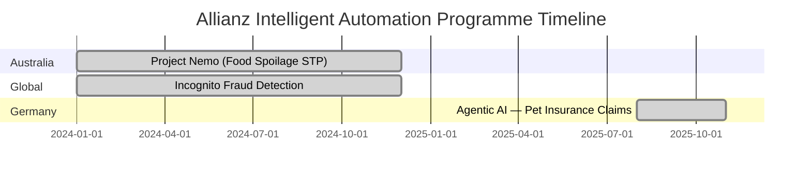

# From Seven Days to Six Hours: How Allianz Rebuilt Claims Processing with Agentic AI

**Version A — With Citations**

---

Allianz received a food spoilage insurance claim from an Australian policyholders and processed it in under a day. Eighteen months earlier, the same claim would have taken seven days to resolve, passed through multiple queues, and required manual data validation at each stage. The technical name for what changed is intelligent automation. The practical name is that Allianz stopped building processes around human capacity constraints and rebuilt them around what the data could do autonomously.

This case study examines three Allianz programmes — Project Nemo (Australia), the German pet insurance agentic AI, and the Incognito fraud detection system — as an integrated portrait of how a global insurer redesigned claims operations using a layered automation strategy deployed across 2024–2025. It also documents the conditions that made this possible and what other organisations would need to replicate the outcome.

---

## Background: What Claims Processing Looked Like Before

Allianz Australia's food spoilage claims function was a representative example of how insurance claims processing has historically worked. A claim arrived — digitally or by post. Staff manually extracted the relevant data, entered it into the claims management system, applied eligibility rules, cross-referenced policy details, and determined payout. For straightforward claims under AUD 500, this process involved no material human judgement — just verification against known parameters — yet it still required human time at each step. Average cycle time: approximately seven days (Allianz Media Centre, 2025).

In Germany, Allianz's pet insurance division faced the same structural issue at higher volume. Pet insurance claims are relatively homogenous in nature: a vet receipt, a policy number, a coverage check. The bottleneck was not complexity — it was throughput. Manual intake and review could not match the volume arriving in peak periods.

Across both markets, the company also faced a harder-to-measure problem: fraud. Traditional detection relied on rule-based flags that identified known fraud patterns. Novel patterns — particularly in high-frequency, low-value claims — required investigator time that the business did not have in unlimited supply. Fraud losses were accumulating in a segment that was simultaneously growing.

---

## The Programme Design

Allianz did not implement a single automation project. It built a layered architecture across three distinct functions:

**Layer 1: Straight-Through Processing (Project Nemo, Australia)**
Project Nemo automated the full claims lifecycle for food spoilage claims under AUD 500. The system ingests the claim, validates coverage, checks policy status, applies pre-approved eligibility logic, calculates the settlement amount, and initiates payment — without human review, provided the claim meets defined parameters.

The design criteria were specific: the claim amount was capped at AUD 500, the product class was narrow (food spoilage), and the policy data was structured and machine-readable. These conditions — a defined claim type, a bounded value, and clean input data — are essential to understanding where straight-through processing is viable. Allianz did not attempt to automate claims requiring judgement; it automated claims that required verification.

Result: Cycle time reduced from approximately seven days to under one day (Allianz Media Centre, 2025).

**Layer 2: Agentic AI for Volume Processing (Germany, Pet Insurance)**
Allianz's German operation introduced what the company describes as its first agentic AI deployment — a system capable of not merely following rules but exercising structured reasoning within a defined decision space (Allianz Media Centre, 2025). The distinction matters: agentic AI can handle variability in claim inputs, reconcile partial or inconsistent data, and apply contextual logic that traditional RPA cannot replicate.

By late 2025, the system was fully processing 49.7% of pet insurance claims. The remaining 50.3% — those requiring adjuster judgement, dispute resolution, or policy interpretation — remained with human teams. The agentic system did not replace the workforce; it absorbed the volume that previously consumed that workforce's time on routine work, redirecting their capacity to the claims requiring actual expertise.

**Layer 3: AI-Driven Fraud Detection (Incognito, global)**
The Incognito system operates across claims data to identify patterns indicative of fraud — including novel patterns that pre-defined rule sets would not flag. Unlike the processing automation layers, which reduce cost and cycle time, Incognito directly defends the company's loss ratio.

Result: 29% increase in fraud detection rate (Allianz Media Centre, 2025). Separately, Zurich Insurance's CATIA system — a comparable catastrophe claims AI — identified 500 additional valid claims in 2023 that manual reviewers had missed, worth USD 1.4 million in accurate payouts (Zurich Insurance/Klover.ai analysis).

---

## Implementation Specifics

**Data readiness**: Allianz's ability to automate at this scale rested on structured policy data and machine-readable claim inputs. For the straight-through processing to function, the policy data had to be consistent, complete, and in a format the automation layer could consume reliably. Organisations with fragmented policy records, inconsistent data entry standards, or legacy data locked in non-machine-readable formats will face this prerequisite before automation can deliver equivalent results.

**Human design, not human replacement**: Allianz's stated design principle across all three programmes was that human adjusters retain ownership of complex claims and edge cases. The automation absorbed volume; the humans handled variance. This is not a communications strategy — it reflects the technical reality of where current automation is reliable and where it is not.

**Regulatory and governance context**: Insurance claims in Germany and Australia are subject to regulatory frameworks that require documented decision trails and policyholdernotification standards. Allianz's automation architecture includes audit logging and exception-handling pathways to maintain compliance. Organisations operating in regulated industries should expect governance design to be a material component of implementation effort.

**Timeline**: Project Nemo and the Incognito system were operational during 2024–2025. The agentic AI for pet insurance launched in November 2025. Allianz characterised the latter as the first agentic AI it had deployed at enterprise scale — suggesting the progression from rules-based automation (Nemo, Incognito) to agentic AI was sequential, not simultaneous.

---

## Broader Context: The Insurance Industry's Automation Curve

Allianz's programmes do not exist in isolation. Automation Anywhere deployed its intelligent automation platform at Asia's largest insurance company — an organisation with 20,000 agents — automating 80% of manual processes across HR, finance operations, reporting, partner distribution, compliance, and agency departments. Turn-around times dropped by 50%; error rates on automated workflows reached zero (Automation Anywhere, 2024).

Prudential deployed Google's MedLM large language model via MedScreen Plus — an AI underwriting tool in Hong Kong — achieving a 50% improvement in underwriting speed. Its machine learning lapse prediction engine reduced policy lapse rates by 35% in affected customer segments (Computer Weekly, 2025).

Pega's Smart Claims Engine, deployed across multiple insurers including Church Mutual and Zurich Santander, reports cycle time reductions of up to 80% for claims suitable for straight-through processing (Pega/BusinessWire, 2024).

The AI adoption rate in life insurance rose from 29% to 48% between 2024 and 2025. McKinsey's analysis suggests 25% of the insurance industry's total processes are automatable using current AI and ML techniques.

---

## What Replication Requires

An organisation seeking to replicate Allianz's outcomes in claims automation would need:

1. **Structured, consistent data**: Claims data must be machine-readable and policy records must be complete. Data remediation is typically the longest phase before automation can go live.
2. **A defined starting scope**: Allianz chose a bounded claim type (food spoilage, sub-AUD 500) for its first straight-through processing deployment. Starting with a high-volume, low-complexity, low-value claim type minimises risk while proving the model.
3. **Regulatory design built in from day one**: Audit trails, exception pathways, and policyholder notification standards must be embedded in system design, not retrofitted after deployment.
4. **An agentic layer for variance**: Once rules-based automation is proven, introducing an agentic AI layer — capable of handling variability in inputs — extends the scope of what can be automated without human review.
5. **A clear boundary between automated and human decisions**: Allianz's 49.7% automation rate reflects a design choice, not a technical ceiling. The remaining 50.3% were held back deliberately. Organisations that attempt to automate too broadly — without honest assessment of where AI judgement is reliable — encounter the quality failures that create regulatory and reputational risk.

*Source: Allianz Media Centre (2025, February 5; 2025, November 3).*

| Metric | Before Automation | After Automation | Programme |
|--------|------------------|-----------------|-----------|
| Claims cycle time (food spoilage, sub-AUD 500) | ~7 days | <1 day | Project Nemo (AU) |
| Claims cycle time (pet insurance, simple) | Multi-day | Hours | Agentic AI (DE) |
| Straight-through processing rate (pet insurance) | 0% | 49.7% | Agentic AI (DE) |
| Fraud detection rate | Baseline | +29% | Incognito (Global) |
| Turn-around time (Asian insurer, all claims) | Baseline | −50% | Automation Anywhere |
| Error rate on automated workflows (Asian insurer) | Material | 0% | Automation Anywhere |

*Source: Allianz Media Centre (2025); Automation Anywhere (2024).*

---

## References

Allianz Group. (2025, February 5). *Smarter claims management, smoother settlements*. Allianz Media Centre. https://www.allianz.com/en/mediacenter/news/articles/250205-smarter-claims-management-smoother-settlements.html

Allianz Group. (2025, November 3). *Allianz launched its first agentic AI to automate claims*. Allianz Media Centre. https://www.allianz.com/en/mediacenter/news/articles/251103-when-the-storm-clears-so-should-the-claim-queue.html

Automation Anywhere. (2024). *Asia's largest insurance company case study*. Automation Anywhere Customer Stories. https://www.automationanywhere.com/resources/customer-stories/asia-largest-insurance-company

Computer Weekly. (2025). *Prudential taps AI to improve health insurance experience*. https://www.computerweekly.com/news/366614496/Prudential-taps-AI-to-improve-health-insurance-experience

McKinsey & Company. (2025, November). *The state of AI in 2025: Agents, innovation, and transformation*. McKinsey QuantumBlack. https://www.mckinsey.com/capabilities/quantumblack/our-insights/the-state-of-ai

Pega. (2024, December 11). *Gen AI and automation enhancements help banks accelerate payment disputes*. BusinessWire. https://www.businesswire.com/news/home/20241211846627/en/Gen-AI-and-Automation-Enhancements-Help-Banks-Accelerate-Payment-Disputes-and-Claims-with-New-Edition-of-Pega-Smart-Dispute

---

# From Seven Days to Six Hours: How Allianz Rebuilt Claims Processing with Agentic AI

**Version B — Without In-Text Citations**

---

Allianz received a food spoilage insurance claim from an Australian policyholder and processed it in under a day. Eighteen months earlier, the same claim would have taken seven days to resolve, passed through multiple queues, and required manual data validation at each stage. The technical name for what changed is intelligent automation. The practical name is that Allianz stopped building processes around human capacity constraints and rebuilt them around what the data could do autonomously.

This case study examines three Allianz programmes — Project Nemo (Australia), the German pet insurance agentic AI, and the Incognito fraud detection system — as an integrated portrait of how a global insurer redesigned claims operations using a layered automation strategy deployed across 2024–2025. It also documents the conditions that made this possible and what other organisations would need to replicate the outcome.

---

## Background: What Claims Processing Looked Like Before

Allianz Australia's food spoilage claims function was a representative example of how insurance claims processing has historically worked. A claim arrived — digitally or by post. Staff manually extracted the relevant data, entered it into the claims management system, applied eligibility rules, cross-referenced policy details, and determined payout. For straightforward claims under AUD 500, this process involved no material human judgement — just verification against known parameters — yet it still required human time at each step. Average cycle time: approximately seven days.

In Germany, Allianz's pet insurance division faced the same structural issue at higher volume. Pet insurance claims are relatively homogenous in nature: a vet receipt, a policy number, a coverage check. The bottleneck was not complexity — it was throughput.

Across both markets, the company also faced a harder-to-measure problem: fraud. Traditional detection relied on rule-based flags that identified known fraud patterns. Novel patterns — particularly in high-frequency, low-value claims — required investigator time that the business did not have in unlimited supply.

---

## The Programme Design

Allianz did not implement a single automation project. It built a layered architecture across three distinct functions:

**Layer 1: Straight-Through Processing (Project Nemo, Australia)**
Project Nemo automated the full claims lifecycle for food spoilage claims under AUD 500. The system ingests the claim, validates coverage, checks policy status, applies pre-approved eligibility logic, calculates the settlement amount, and initiates payment — without human review, provided the claim meets defined parameters.

Result: Cycle time reduced from approximately seven days to under one day.

**Layer 2: Agentic AI for Volume Processing (Germany, Pet Insurance)**
Allianz's German operation introduced the company's first agentic AI deployment — a system capable of not merely following rules but exercising structured reasoning within a defined decision space. By late 2025, the system was fully processing 49.7% of pet insurance claims. The remaining 50.3% — those requiring adjuster judgement, dispute resolution, or policy interpretation — remained with human teams.

**Layer 3: AI-Driven Fraud Detection (Incognito, global)**
The Incognito system operates across claims data to identify patterns indicative of fraud — including novel patterns that pre-defined rule sets would not flag. Result: 29% increase in fraud detection rate.

---

## Implementation Specifics

**Data readiness**: Allianz's ability to automate at this scale rested on structured policy data and machine-readable claim inputs. Organisations with fragmented policy records or legacy data locked in non-machine-readable formats will face this prerequisite before automation can deliver equivalent results.

**Human design, not human replacement**: Allianz's stated design principle across all three programmes was that human adjusters retain ownership of complex claims and edge cases. The automation absorbed volume; the humans handled variance.

**Regulatory and governance context**: Allianz's automation architecture includes audit logging and exception-handling pathways to maintain compliance across German and Australian regulatory frameworks.

**Timeline**: Project Nemo and Incognito were operational during 2024–2025. The agentic AI for pet insurance launched in November 2025 — the company's first agentic AI deployment at enterprise scale.

---

## Broader Context: The Insurance Industry's Automation Curve

Automation Anywhere deployed its intelligent automation platform at Asia's largest insurance company — 20,000 agents — automating 80% of manual processes. Turn-around times dropped by 50%; error rates on automated workflows reached zero. Prudential's MedScreen Plus underwriting tool achieved a 50% improvement in underwriting speed in Hong Kong. Pega's Smart Claims Engine reports cycle time reductions of up to 80% for claims suitable for straight-through processing. AI adoption in life insurance rose from 29% to 48% between 2024 and 2025.

---

## What Replication Requires

1. **Structured, consistent data**: Claims data must be machine-readable.
2. **A defined starting scope**: Start with a bounded, high-volume, low-complexity claim type.
3. **Regulatory design built in from day one**: Audit trails and exception pathways must be embedded in system design.
4. **An agentic layer for variance**: Rules-based automation first; agentic AI extends scope once reliability is proven.
5. **A clear boundary between automated and human decisions**: Automation 49.7% reflects a design choice, not a technical ceiling.

*Source: Allianz Media Centre (2025, February 5; 2025, November 3).*

| Metric | Before Automation | After Automation | Programme |
|--------|------------------|-----------------|-----------|
| Claims cycle time (food spoilage, sub-AUD 500) | ~7 days | <1 day | Project Nemo (AU) |
| Claims cycle time (pet insurance, simple) | Multi-day | Hours | Agentic AI (DE) |
| Straight-through processing rate (pet insurance) | 0% | 49.7% | Agentic AI (DE) |
| Fraud detection rate | Baseline | +29% | Incognito (Global) |
| Turn-around time (Asian insurer, all claims) | Baseline | −50% | Automation Anywhere |
| Error rate on automated workflows (Asian insurer) | Material | 0% | Automation Anywhere |

*Source: Allianz Media Centre (2025); Automation Anywhere (2024).*

---

## References

Allianz Group. (2025, February 5). *Smarter claims management, smoother settlements*. Allianz Media Centre. https://www.allianz.com/en/mediacenter/news/articles/250205-smarter-claims-management-smoother-settlements.html

Allianz Group. (2025, November 3). *Allianz launched its first agentic AI to automate claims*. Allianz Media Centre. https://www.allianz.com/en/mediacenter/news/articles/251103-when-the-storm-clears-so-should-the-claim-queue.html

Automation Anywhere. (2024). *Asia's largest insurance company case study*. Automation Anywhere Customer Stories. https://www.automationanywhere.com/resources/customer-stories/asia-largest-insurance-company

Computer Weekly. (2025). *Prudential taps AI to improve health insurance experience*. https://www.computerweekly.com/news/366614496/Prudential-taps-AI-to-improve-health-insurance-experience

McKinsey & Company. (2025, November). *The state of AI in 2025: Agents, innovation, and transformation*. McKinsey QuantumBlack. https://www.mckinsey.com/capabilities/quantumblack/our-insights/the-state-of-ai

Pega. (2024, December 11). *Gen AI and automation enhancements help banks accelerate payment disputes*. BusinessWire. https://www.businesswire.com/news/home/20241211846627/en/Gen-AI-and-Automation-Enhancements-Help-Banks-Accelerate-Payment-Disputes-and-Claims-with-New-Edition-of-Pega-Smart-Dispute
