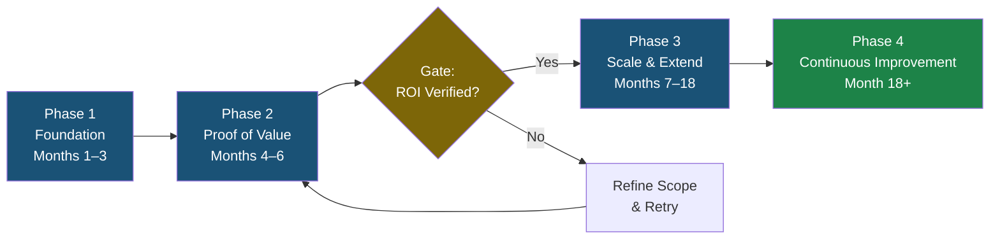
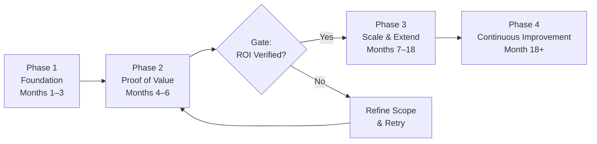

# Executive Content — Intelligent Automation Wins: Where the Returns Are Real

**Version A — With Citations**

---

## Variant 1: C-Suite Brief

**Intelligent automation has moved from pilot to production. The companies delivering measurable results share one characteristic: they redesigned workflows, not just the tools running them.**

### What Is Happening
88% of organisations now deploy AI in at least one business function (McKinsey & Company, 2025). The ones achieving measurable impact — only 39% at enterprise level — treated automation as infrastructure requiring governance, data quality investment, and workflow redesign, not a software rollout.

### The Numbers That Matter
- **JPMorgan Chase**: 360,000 legal hours saved per year via COiN contract review (ABA Journal, 2023)
- **BBVA**: 2.8 hours/week saved per employee across 120,000 staff; 80% efficiency gains in legal workflows (OpenAI, 2025)
- **Allianz Australia**: Food spoilage claims — 7 days → under 1 day via Project Nemo (Allianz, 2025)
- **Microsoft Power Automate**: 248% ROI over 3 years; payback under 6 months (Forrester/Microsoft, 2024)
- **Walmart**: USD 55 million saved via Self-Healing Inventory (Logistics Viewpoints, 2025)
- **UPS ORION**: 100 million delivery miles eliminated per year (logistics industry sources)

### The Risk You Cannot Ignore
95% of enterprise generative AI pilots fail to deliver measurable P&L impact — primarily due to fragmented data, legacy integration complexity, and absent governance (MIT study, as reported by Fortune, 2025). Gartner predicts 40%+ of agentic AI projects will be cancelled by end of 2027 (Gartner, June 2025).

### Your Three Questions
1. Do we have a data quality programme underway ahead of automation deployment?
2. Have we identified our three highest-volume, most repetitive processes as automation candidates?
3. Is our governance framework for AI decision-making documented and tested?

---

## Variant 2: Implementation Roadmap

### Intelligent Automation: From First Pilot to Enterprise Scale

**Phase 1 — Foundation (Months 1–3)**
- Audit data quality across target automation domains; identify and remediate gaps
- Map the five highest-volume, lowest-complexity processes in your highest-cost function
- Select platform: Microsoft Power Automate (248% ROI, payback <6 months — Forrester 2024), UiPath (97% ROI — Forrester 2024), Automation Anywhere, or ServiceNow depending on existing infrastructure
- Establish governance framework: decision audit trails, exception handling, human escalation pathways

**Phase 2 — Proof of Value (Months 4–6)**
- Deploy rules-based RPA on one or two bounded, high-volume processes
- Instrument KPIs from day one: cycle time, error rate, hours recovered, cost per transaction
- Run parallel human/automated processing for 4–6 weeks before full handover

**Phase 3 — Scale and Extend (Months 7–18)**
- Extend proven automation to adjacent processes; add NLP/ML layers for judgment-based tasks
- Introduce generative AI workflow tools (Microsoft 365 Copilot, Salesforce Agentforce) for knowledge worker productivity
- Evaluate agentic AI for multi-step, variable processes once rules-based layer is stable

**Phase 4 — Continuous Improvement (Month 18+)**
- Track EBIT attribution; benchmark against McKinsey high-performer threshold (5%+ EBIT impact)
- Introduce AI governance tooling (IBM watsonx.governance) as agent complexity increases

*Key milestones: Phase 1 — data audit complete, governance framework documented; Phase 2 — first process live, KPIs instrumented; Phase 3 — 5+ processes automated, generative AI layer introduced; Phase 4 — EBIT attribution tracked.*

**Vendor Comparison**

| Platform | 3-Year ROI | Payback Period | Primary Use Cases | Agentic AI Capability |
|---|---|---|---|---|
| Microsoft Power Automate | 248% | <6 months | Finance, HR, operations automation | Via Copilot Studio agents |
| UiPath | 97% | ~12 months | RPA, IDP, document processing | UiPath Agent Platform (2025) |
| Automation Anywhere | Not publicly disclosed | Not disclosed | Insurance, banking, back-office | Automation Co-Pilot |
| ServiceNow | 310% (healthcare) | <6 months | ITSM, HR, cross-enterprise workflows | Now Assist AI agents |
| Salesforce Agentforce | Not disclosed | Not disclosed | CRM, customer service, sales | Natively agentic |

*Sources: Forrester TEI for Microsoft Power Automate (2024); Forrester TEI for UiPath (2024); ServiceNow case study (2024/2025); Salesforce customer stories (2025). ROI figures from independent Forrester TEI studies where available.*

---

## Variant 3: Board Report

### AI and Intelligent Automation — Board Briefing
**Date**: March 2026

#### Strategic Context
Intelligent automation is no longer a competitive advantage for early movers. It is table stakes. 88% of organisations now use AI in at least one function (McKinsey, 2025). The minority achieving measurable EBIT impact — 39% — have done so by treating automation as enterprise infrastructure, not technology experimentation.

#### The Investment Case
- Companies with fully AI-led processes achieve **2.5x higher revenue growth** and **2.4x greater productivity** than peers (Accenture, 2024)
- Productivity growth in AI-exposed industries has nearly **quadrupled** (7% to 27%) between 2018–2022 and 2018–2024 (PwC, 2025)
- Average enterprise AI investment: USD 130 million (KPMG, Q3 2025)
- Gartner projects the hyperautomation software market will reach **USD 1.04 trillion by 2026**

#### Documented Peer Outcomes
| Organisation | Platform | Outcome | Source |
|---|---|---|---|
| JPMorgan Chase | COiN (NLP) | 360,000 hours/year saved | ABA Journal, 2023 |
| BBVA | ChatGPT Enterprise | 2.8 hrs/week per employee; 80% legal efficiency gains | OpenAI, 2025 |
| Walmart | Self-Healing Inventory | USD 55M saved | Logistics Viewpoints, 2025 |
| Allianz Australia | Project Nemo | 7 days → <1 day (claims) | Allianz, 2025 |
| Deloitte | UiPath | 4M+ labour hours saved | UiPath case study |

*Sources: ABA Journal (2023); OpenAI (2025); Logistics Viewpoints (2025); Allianz Media Centre (2025); UiPath (2024)*

#### Risk Factors Requiring Board Attention
1. **Data debt**: USD 1.5–2 trillion in accumulated technical debt across the Global 2000 (HFS Research, 2025). AI projects fail on data quality, not model capability.
2. **Governance gap**: Only one in five companies has a mature governance model for autonomous AI agents. Regulatory risk increases as agent autonomy increases.
3. **Abandonment rate**: 42% of companies scrapped most AI initiatives in 2025 (up from 17% in 2024). Failure is most common where strategy is unclear and data foundations are weak.

#### Board-Level Questions
1. Has management defined a measurable EBIT target for our AI programme?
2. What is our current data quality maturity score, and what investment is planned to improve it?
3. Has an AI governance policy been reviewed and approved at board level?

---

## Variant 4: Team Update

### AI Automation Wins — What Peers Are Achieving and What We Should Know

The evidence from 2024–2025 makes it clear: intelligent automation is delivering results in specific, documented ways. Here is what the most relevant company examples show:

**Where the wins are happening:**

- **Finance teams**: BBVA automated 9,000+ routine legal queries per year using ChatGPT Enterprise, freeing three staff members who now produce 11,000 documents instead. Deloitte saved 4 million+ labour hours by automating 600+ internal processes with UiPath.

- **Operations and claims**: Allianz processes 49.7% of pet insurance claims with zero human involvement. Asia's largest insurer automated 80% of manual processes across six departments — turn-around times cut by 50%.

- **Supply chain and logistics**: Walmart's inventory AI saved USD 55 million. UPS's ORION route AI eliminated 100 million delivery miles per year. DHL achieved 35% productivity uplift in automated warehouses.

- **Knowledge work**: Microsoft 365 Copilot at Vodafone saves 3 hours per employee per week — roughly 10% of a working week, back in each person's hands.

**What the failures look like (so we avoid them):**

95% of enterprise generative AI pilots fail to deliver P&L impact. The reasons are not the AI — they are: data that is not clean or structured enough for automation to act on; legacy systems that the automation cannot connect to; no governance framework to catch errors.

The companies with the best results started small (one bounded process, one department), proved the ROI in 6–12 months, then scaled. They also invested in data quality before the automation went live — not after.

**Next Steps for Our Team:**
1. Identify our three most repetitive, high-volume processes and bring them to the next planning session
2. Have IT assess current data quality in those processes — is it structured and machine-readable?
3. Review Microsoft Power Automate options — Forrester's independent study found 248% ROI and under 6 months to payback for enterprise deployments

---

## References (Version A)

Accenture. (2024). *New Accenture research finds that companies with AI-led processes outperform peers*. Accenture Newsroom. https://newsroom.accenture.com/news/2024/new-accenture-research-finds-that-companies-with-ai-led-processes-outperform-peers

ABA Journal. (2023). *JPMorgan Chase uses tech to save 360,000 hours of annual work*. https://www.abajournal.com/news/article/jpmorgan_chase_uses_tech_to_save_360000_hours_of_annual_work_by_lawyers_and

Allianz Group. (2025, February 5). *Smarter claims management, smoother settlements*. Allianz Media Centre. https://www.allianz.com/en/mediacenter/news/articles/250205-smarter-claims-management-smoother-settlements.html

Forrester Consulting. (2024, July). *The total economic impact™ of Microsoft Power Automate*. Commissioned by Microsoft. https://info.microsoft.com/ww-landing-2024-The-Total-Economic-Impact-of-Power-Platform.html

Gartner. (2025, June 25). *Gartner predicts over 40% of agentic AI projects will be canceled by end of 2027*. https://www.gartner.com/en/newsroom/press-releases/2025-06-25-gartner-predicts-over-40-percent-of-agentic-ai-projects-will-be-canceled-by-end-of-2027

HFS Research & Publicis Sapient. (2025, May). *Smash through tech debt: Why AI is the jackhammer*. https://www.publicissapient.com/resources/research/hfs-ai-tech-debt

KPMG US. (2025, Q4). *AI at scale: How 2025 set the stage for agent-driven enterprise reinvention in 2026*. https://kpmg.com/us/en/media/news/q4-ai-pulse.html

Logistics Viewpoints. (2025, March 19). *Walmart and the new supply chain reality*. https://logisticsviewpoints.com/2025/03/19/walmart-and-the-new-supply-chain-reality-ai-automation-and-resilience/

McKinsey & Company. (2025, November). *The state of AI in 2025*. McKinsey QuantumBlack. https://www.mckinsey.com/capabilities/quantumblack/our-insights/the-state-of-ai

MIT study as reported by Fortune. (2025, August 18). *MIT report: 95% of generative AI pilots at companies are failing*. Fortune. https://fortune.com/2025/08/18/mit-report-95-percent-generative-ai-pilots-at-companies-failing-cfo/

OpenAI. (2025). *From pilot to practice: How BBVA is scaling AI across the organisation*. https://openai.com/index/bbva-2025/

PwC. (2025, June). *2025 global AI jobs barometer*. https://www.pwchk.com/en/press-room/press-releases/pr-130625.html

UiPath. (2024). *Deloitte customer story*. Referenced in Forrester TEI for UiPath.

---

# Executive Content — Intelligent Automation Wins: Where the Returns Are Real

**Version B — Without In-Text Citations**

---

## Variant 1: C-Suite Brief

**Intelligent automation has moved from pilot to production. The companies delivering measurable results share one characteristic: they redesigned workflows, not just the tools running them.**

### What Is Happening
88% of organisations now deploy AI in at least one business function. The ones achieving measurable impact — only 39% at enterprise level — treated automation as infrastructure requiring governance, data quality investment, and workflow redesign, not a software rollout.

### The Numbers That Matter
- **JPMorgan Chase**: 360,000 legal hours saved per year via COiN contract review
- **BBVA**: 2.8 hours/week saved per employee across 120,000 staff; 80% efficiency gains in legal workflows
- **Allianz Australia**: Food spoilage claims — 7 days → under 1 day via Project Nemo
- **Microsoft Power Automate**: 248% ROI over 3 years; payback under 6 months
- **Walmart**: USD 55 million saved via Self-Healing Inventory
- **UPS ORION**: 100 million delivery miles eliminated per year

### The Risk You Cannot Ignore
95% of enterprise generative AI pilots fail to deliver measurable P&L impact — primarily due to fragmented data, legacy integration complexity, and absent governance. Gartner predicts 40%+ of agentic AI projects will be cancelled by end of 2027.

### Your Three Questions
1. Do we have a data quality programme underway ahead of automation deployment?
2. Have we identified our three highest-volume, most repetitive processes as automation candidates?
3. Is our governance framework for AI decision-making documented and tested?

---

## Variant 2: Implementation Roadmap

### Intelligent Automation: From First Pilot to Enterprise Scale

**Phase 1 — Foundation (Months 1–3)**
- Audit data quality across target automation domains; identify and remediate gaps
- Map the five highest-volume, lowest-complexity processes in your highest-cost function
- Select platform based on existing infrastructure and use case fit
- Establish governance framework: decision audit trails, exception handling, human escalation pathways

**Phase 2 — Proof of Value (Months 4–6)**
- Deploy rules-based RPA on one or two bounded, high-volume processes
- Instrument KPIs from day one: cycle time, error rate, hours recovered, cost per transaction
- Run parallel human/automated processing for 4–6 weeks before full handover

**Phase 3 — Scale and Extend (Months 7–18)**
- Extend proven automation to adjacent processes; add NLP/ML layers for judgment-based tasks
- Introduce generative AI workflow tools for knowledge worker productivity
- Evaluate agentic AI for multi-step, variable processes once rules-based layer is stable

**Phase 4 — Continuous Improvement (Month 18+)**
- Track EBIT attribution; benchmark against high-performer threshold (5%+ EBIT impact)
- Introduce AI governance tooling as agent complexity increases

*Key milestones: Phase 1 — data audit complete, governance framework documented; Phase 2 — first process live, KPIs instrumented; Phase 3 — 5+ processes automated; Phase 4 — EBIT attribution tracked.*

**Vendor Comparison**

| Platform | 3-Year ROI | Payback Period | Primary Use Cases | Agentic AI Capability |
|---|---|---|---|---|
| Microsoft Power Automate | 248% | <6 months | Finance, HR, operations automation | Via Copilot Studio agents |
| UiPath | 97% | ~12 months | RPA, IDP, document processing | UiPath Agent Platform (2025) |
| Automation Anywhere | Not publicly disclosed | Not disclosed | Insurance, banking, back-office | Automation Co-Pilot |
| ServiceNow | 310% (healthcare) | <6 months | ITSM, HR, cross-enterprise workflows | Now Assist AI agents |
| Salesforce Agentforce | Not disclosed | Not disclosed | CRM, customer service, sales | Natively agentic |

*Sources: Forrester TEI for Microsoft Power Automate (2024); Forrester TEI for UiPath (2024); ServiceNow case study (2024/2025); Salesforce customer stories (2025). ROI figures from independent Forrester TEI studies where available.*

---

## Variant 3: Board Report

### AI and Intelligent Automation — Board Briefing
**Date**: March 2026

#### Strategic Context
Intelligent automation is no longer a competitive advantage for early movers. It is table stakes. 88% of organisations now use AI in at least one function. The minority achieving measurable EBIT impact — 39% — have done so by treating automation as enterprise infrastructure, not technology experimentation.

#### The Investment Case
- Companies with fully AI-led processes achieve **2.5x higher revenue growth** and **2.4x greater productivity** than peers
- Productivity growth in AI-exposed industries has nearly **quadrupled** (7% to 27%) over the past six years
- Average enterprise AI investment: USD 130 million (Q3 2025)
- Gartner projects the hyperautomation software market will reach **USD 1.04 trillion by 2026**

#### Documented Peer Outcomes
| Organisation | Platform | Outcome |
|---|---|---|
| JPMorgan Chase | COiN (NLP) | 360,000 hours/year saved |
| BBVA | ChatGPT Enterprise | 2.8 hrs/week per employee; 80% legal efficiency gains |
| Walmart | Self-Healing Inventory | USD 55M saved |
| Allianz Australia | Project Nemo | 7 days → <1 day (claims) |
| Deloitte | UiPath | 4M+ labour hours saved |

#### Risk Factors Requiring Board Attention
1. **Data debt**: USD 1.5–2 trillion in accumulated technical debt across the Global 2000. AI projects fail on data quality, not model capability.
2. **Governance gap**: Only one in five companies has a mature governance model for autonomous AI agents.
3. **Abandonment rate**: 42% of companies scrapped most AI initiatives in 2025 — up from 17% in 2024.

#### Board-Level Questions
1. Has management defined a measurable EBIT target for our AI programme?
2. What is our current data quality maturity score, and what investment is planned to improve it?
3. Has an AI governance policy been reviewed and approved at board level?

---

## Variant 4: Team Update

### AI Automation Wins — What Peers Are Achieving and What We Should Know

The evidence from 2024–2025 makes it clear: intelligent automation is delivering results in specific, documented ways. Here is what the most relevant company examples show:

**Where the wins are happening:**

- **Finance teams**: BBVA automated 9,000+ routine legal queries per year using ChatGPT Enterprise, freeing three staff members who now produce 11,000 documents instead. Deloitte saved 4 million+ labour hours by automating 600+ internal processes with UiPath.
- **Operations and claims**: Allianz processes 49.7% of pet insurance claims with zero human involvement.
- **Supply chain and logistics**: Walmart's inventory AI saved USD 55 million. UPS's ORION eliminated 100 million delivery miles per year.
- **Knowledge work**: Microsoft 365 Copilot at Vodafone saves 3 hours per employee per week.

**What the failures look like:**
95% of enterprise generative AI pilots fail to deliver P&L impact. The reasons are data quality, legacy integration, and absent governance — not AI capability.

**Next Steps:**
1. Identify our three most repetitive, high-volume processes and bring them to the next planning session
2. Have IT assess current data quality in those processes
3. Review Microsoft Power Automate options — independent study found 248% ROI and under 6 months to payback

---

## References (Version B)

Accenture. (2024). *New Accenture research finds that companies with AI-led processes outperform peers*. Accenture Newsroom. https://newsroom.accenture.com/news/2024/new-accenture-research-finds-that-companies-with-ai-led-processes-outperform-peers

ABA Journal. (2023). *JPMorgan Chase uses tech to save 360,000 hours of annual work*. https://www.abajournal.com/news/article/jpmorgan_chase_uses_tech_to_save_360000_hours_of_annual_work_by_lawyers_and

Allianz Group. (2025, February 5). *Smarter claims management, smoother settlements*. Allianz Media Centre. https://www.allianz.com/en/mediacenter/news/articles/250205-smarter-claims-management-smoother-settlements.html

Forrester Consulting. (2024, July). *The total economic impact™ of Microsoft Power Automate*. https://info.microsoft.com/ww-landing-2024-The-Total-Economic-Impact-of-Power-Platform.html

Gartner. (2025, June 25). *Gartner predicts over 40% of agentic AI projects will be canceled by end of 2027*. https://www.gartner.com/en/newsroom/press-releases/2025-06-25-gartner-predicts-over-40-percent-of-agentic-ai-projects-will-be-canceled-by-end-of-2027

McKinsey & Company. (2025, November). *The state of AI in 2025*. McKinsey QuantumBlack. https://www.mckinsey.com/capabilities/quantumblack/our-insights/the-state-of-ai

OpenAI. (2025). *From pilot to practice: How BBVA is scaling AI across the organisation*. https://openai.com/index/bbva-2025/

PwC. (2025, June). *2025 global AI jobs barometer*. https://www.pwchk.com/en/press-room/press-releases/pr-130625.html
