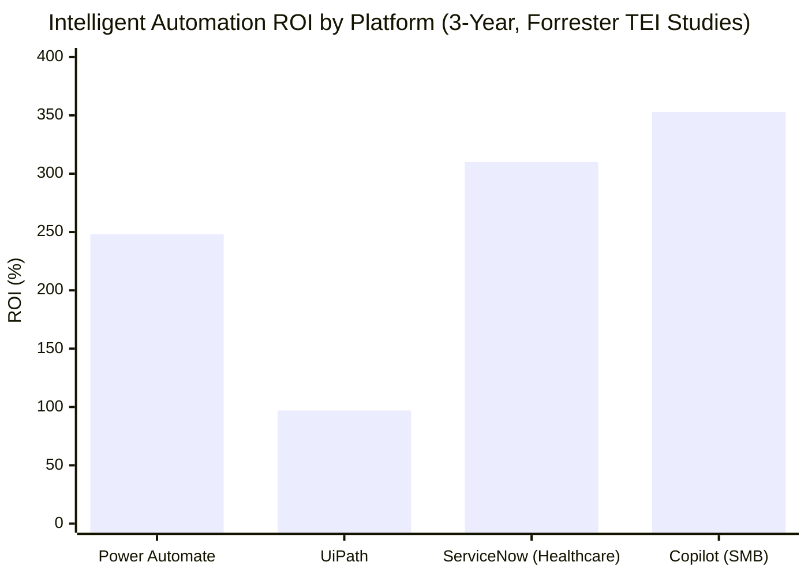

# Intelligent Automation Is Delivering: What the Evidence Shows, What Failed Before, and What We Should Do Next

**Version A — With Citations | Internal Circulation**
**Date**: March 2026

---

## Section 1: Why This Topic Now

Deloitte automated 600 internal processes using UiPath and recovered more than four million cumulative labour hours (UiPath, 2024). That is not a projection — it is a documented outcome from a professional services firm that applied intelligent automation to its own operations before recommending it to clients. When Deloitte treats its own workforce as the test case, the results are worth examining closely.

This briefing sets out the evidence on intelligent automation across six industries from 2024 to 2026: what specific problems existed before automation was introduced, what tools solved them, and what measurable results followed. It also documents what failed, and why — because the 95% of enterprise generative AI pilots that failed to deliver P&L impact (MIT study, as reported by Fortune, 2025) failed for reasons that are entirely preventable.

The final section identifies specific opportunities for our teams, by function, with named tools, verified outcomes, and concrete first steps.

---

## Section 2: The Before — What Problems Were Costing Us

The problems intelligent automation is solving were not abstract inefficiencies. They were specific, measurable, and chronic.

**JPMorgan Chase's legal team reviewed 12,000 commercial credit agreements per year entirely by hand.** The task consumed approximately 360,000 hours of legal staff time annually (ABA Journal, 2023). The error rate was material: minor misinterpretations in contract parsing generated downstream loan-servicing mistakes. This was not a niche problem — it was a core operational function of one of the world's largest financial institutions, and it was running on human capacity alone.

**Allianz Australia's food spoilage claims took seven days to process.** Claims under AUD 500 — representing a significant portion of volume, requiring no substantive human judgement — were queued, manually extracted, entered into systems, validated against policy terms, and approved by staff. The same person doing this work could have been doing something that required their actual expertise. Instead, they were doing data entry (Allianz Media Centre, 2025).

**Wells Fargo's service centre handled routine queries — password resets, balance enquiries, product questions — through human agents.** In 2023, the Fargo virtual assistant managed 21.3 million such interactions. Those same interactions, previously handled by human staff, represented an enormous and completely automatable cost base (VentureBeat, 2025).

**Siemens engineers spent multiple days creating panel visualisations for industrial automation code.** This was skilled engineering time consumed by a task that required precision but not creative judgement — the ideal profile for automation. In high-volume manufacturing environments, this was a systematic bottleneck across every project (Siemens Press, 2025).

**Asia's largest insurance company — with 20,000 agents — had manual workflows spanning HR, finance operations, reporting, partner distribution, compliance, and agency departments.** The processes were high-volume, repetitive, and error-prone. There was no shortage of human effort; there was a shortage of human effort applied to work that actually required it (Automation Anywhere, 2024).

These examples share a pattern. The problem was not that the organisations lacked capable people. The problem was that capable people were trapped in work designed for rules and repetition, not judgement and expertise. Intelligent automation's primary contribution is not replacing people — it is releasing them from work that machines can do more reliably.

---

## Section 3: The Solutions — Named Tools, Specific Deployments

The following implementations are documented, sourced, and represent the strongest available evidence from 2024–2026.

### Financial Services

**JPMorgan Chase — COiN (Contract Intelligence)**: A natural language processing system using unsupervised machine learning, now processing 12,000 commercial credit agreements per year with near-zero error rates. The 360,000 hours of annual legal review the system replaced have not been eliminated — legal staff now work on the claims and disputes the system cannot resolve (ABA Journal, 2023).

**Bank of America — AI Coding Tools + Erica for Employees**: GitHub Copilot-equivalent AI coding tools deployed to 17,000 developers reduced coding work by 30% — the equivalent of approximately 2,000 people's capacity freed for higher-value software work. More than 210,000 associates now use Erica for Employees for administrative tasks (CIO Dive, 2025).

**BBVA — ChatGPT Enterprise (OpenAI)**: Rolled out to all 120,000 employees. The legal division automated 9,000+ routine queries per year, freeing three full-time equivalents who now produce 11,000+ documents annually. Organisation-wide, the average saving is 2.8 hours per week per employee. The bank's teams built 20,000+ Custom GPTs internally for specific workflow applications (OpenAI, 2025).

**Wells Fargo — Fargo (Google Gemini 2.0 Flash)**: 245 million interactions in 2024, up from 21.3 million in 2023. Deployed to 180,000+ desktops. The system handles routine queries, freeing service staff for complex cases (VentureBeat, 2025).

### Insurance

**Allianz — Layered Automation Across Markets**: Project Nemo (Australia) reduced food spoilage claims processing from seven days to under one day. The pet insurance agentic AI in Germany — the company's first agentic deployment — now fully processes 49.7% of claims, with simple claims paid within hours. The Incognito fraud detection system achieved a 29% increase in fraud identification (Allianz Media Centre, 2025).

**Automation Anywhere — Asia's Largest Insurer**: 80% of manual processes automated across six departments. Turn-around time reduced by 50%. Error rate on automated workflows: zero. The same organisation that previously consumed enormous staff time on data entry now directs that capacity to client relationship management and complex case resolution (Automation Anywhere, 2024).

**Prudential — MedLM + MedScreen Plus**: Google's MedLM large language model, deployed via Vertex AI, powers straight-through processing for claims and an automated underwriting tool in Hong Kong. Underwriting speed improved by 50%. A separate machine learning engine for policy lapse prediction reduced lapse rates by 35% in affected segments (Computer Weekly, 2025).

### Manufacturing

**Siemens Industrial Copilot (100+ customers, built on Azure OpenAI Service)**: Panel visualisations created in 30 seconds versus multiple days previously. Generated automation code requires only 20% human adaptation. A pilot across customer installations demonstrated a 25% reduction in reactive maintenance time. Deployed to Thyssenkrupp Automation Engineering for global rollout from 2025 (Siemens Press, 2025).

**Procter & Gamble — AI Demand Forecasting**: AI-based demand sensing reduced forecast errors by 30%, delivered a 20% improvement in on-time delivery, and contributed to an estimated USD 300 million in inventory cost savings (McKinsey-referenced case analysis).

### Logistics and Supply Chain

**UPS — ORION**: Machine learning route optimisation eliminates 100 million delivery miles per year — saving 10 million gallons of fuel and generating approximately USD 300–400 million in annual cost savings.

**DHL — AI Orchestration (USD 700 million investment, 2024)**: 35% warehouse productivity increase, 99.7% order accuracy, 60% faster integration implementation across facilities (DHL, 2024).

**Walmart — Self-Healing Inventory + Pactum AI**: USD 55 million saved through agentic inventory self-correction. Pactum AI's automated supplier negotiation system secured agreements with 68% of suppliers approached at a 1.5% cost reduction. Shift scheduling reduced from 90 minutes to 30 minutes per manager per week (Logistics Viewpoints, 2025).

**Amazon — Wellspring + AI Forecasting Model**: 40%+ improvement in optimal inventory placement year-on-year. Same-day delivery network expanded 60% in FY2024 (Supply Chain Dive, 2025).

### Healthcare

**Mayo Clinic — 34 Virtual Workers**: Revenue cycle tasks — claims submission, coding, denial management — previously handled manually are now managed by 34 AI-powered virtual workers. Human staff redirected to complex denial resolution and payer negotiation.

**Cleveland Clinic — Aidoc DeepCertainty**: AI-assisted detection for fractures, lung nodules, and stroke integrated into radiology workflows at a scale that matches the volume demands individual radiologists cannot sustain.

**Enterprise-Wide**: Microsoft Power Automate — Forrester's independent 2024 Total Economic Impact study found a three-year ROI of 248%, an NPV of USD 39.85 million, and a payback period of under six months for a composite enterprise deployment (Forrester/Microsoft, 2024). Microsoft 365 Copilot at Vodafone saves 3 hours per employee per week; at the Commercial Bank of Dubai, 39,000 hours per year (Microsoft/Forrester, 2024).

---

## Section 4: The Honest Picture — Why Most Pilots Fail

The failure rate demands attention. MIT research, reported by Fortune in August 2025, found that 95% of enterprise generative AI pilots fail to deliver measurable P&L impact. Gartner predicts over 40% of agentic AI projects will be cancelled by end of 2027 due to escalating costs, unclear business value, or inadequate risk controls (Gartner, June 2025). And 42% of companies scrapped most AI initiatives in 2025 — up from 17% in 2024.

The failures are not random. They cluster around three causes:

**1. Data quality.** 77% of organisations rate their data as average, poor, or very poor for AI readiness (AIIM 2024). HFS Research estimates the Global 2000 carry USD 1.5–2 trillion in accumulated technical debt, with fragmented data identified as the primary cause of AI project failure (HFS Research/Publicis Sapient, 2025). Automation cannot function reliably on data it cannot read. The organisations that deployed successfully — Allianz, JPMorgan, Deloitte — all had structured, consistent, machine-readable data in the processes they automated first.

**2. Legacy integration complexity.** 41% of enterprise leaders report difficulty integrating AI with legacy systems (HFS Research, 2025). Organisations that layer automation onto brittle legacy infrastructure often accelerate dysfunction rather than resolve it. The Allianz case is instructive: it started with claims types that had clean, structured inputs and bounded logic — not with its most complex processes.

**3. Absent governance.** Only one in five companies has a mature governance model for autonomous AI agents (McKinsey, 2025). Without documented decision audit trails, human escalation pathways, and exception-handling protocols, automation failures become compliance and reputational events rather than technical problems to fix.

The organisations in McKinsey's "high performer" category — the 6% attributing more than 5% EBIT improvement to AI — are 3.6 times more likely to pursue enterprise-level transformation and are 55% more likely to fundamentally redesign workflows rather than automate existing ones. The discipline is in the design, not the tool.

---

## Section 5: Application by Function

*Source: Forrester Consulting TEI studies (Microsoft 2024, UiPath 2024, ServiceNow 2024/2025). ROI = net present value over 3 years as a percentage of investment.*

The following identifies where intelligent automation delivers the clearest, fastest return for each organisational function, with a named tool, a verified outcome from a peer organisation, and a concrete first step our team can take.

| Function | AI Tool | Verified Outcome | First Step |
|---|---|---|---|
| Legal / Compliance | JPMorgan COiN (NLP/ML) OR IBM watsonx.governance | 360,000 legal hours/year saved (JPMorgan); 50% compliance review cycle reduction (IBM watsonx.governance, top-10 US bank) | Map all routine contract review and compliance query volume in the past 12 months; identify the highest-volume, most repetitive document types |
| Finance / Accounts Payable | Microsoft Power Automate OR UiPath | 248% ROI over 3 years; <6-month payback (Forrester/Microsoft, 2024); 4M+ hours saved at Deloitte | Audit the five most manual invoice processing or reconciliation steps; assess data quality and structure of source records |
| Customer Service / CX | Salesforce Agentforce OR Wells Fargo–style LLM assistant | 70% of chat engagements resolved autonomously (1-800Accountant via Salesforce Agentforce); 245 million interactions handled (Wells Fargo Fargo in 2024) | Categorise the top 20 most common inbound customer queries; identify which require human judgement and which are information retrieval only |
| HR / People Operations | Automation Anywhere OR ServiceNow AI | 80% of HR manual processes automated; 50% turn-around reduction (Asia's largest insurer) | Review onboarding, offboarding, and leave request workflows for manual data entry steps that could be automated |
| Supply Chain / Procurement | Pactum AI (supplier negotiations) OR Microsoft Power Automate | 68% supplier agreement rate; 1.5% cost reduction (Walmart/Pactum AI, 2025) | Identify supplier negotiation volume and manual procurement approval workflows; assess whether supplier data is structured for AI ingestion |
| Marketing / Sales Intelligence | Salesforce Einstein OR Microsoft 365 Copilot | 3 hours/week per employee saved (Vodafone, Microsoft 365 Copilot); CRM activity automation reduces manual entry | Audit time spent on CRM data entry, campaign reporting, and performance analysis; establish a baseline hours figure for the team |
| IT Operations | ServiceNow AI Platform OR IBM watsonx Orchestrate | 310% ROI over 3 years for healthcare provider; manufacturing customer: USD 4.7M 5-year NPV (ServiceNow) | Map incident ticket volume by category; identify which categories are repetitive and self-resolvable with AI-assisted routing |

---

## Section 6: The Transition Underway — Agentic AI

The evidence points to a structural shift that will reshape automation strategy in 2026 and beyond: the move from rules-based RPA to agentic AI.

Traditional RPA executes a defined sequence of steps. It follows a script. Agentic AI can plan, reason, and act across multiple steps — handling variability in inputs and adapting its approach based on context. Allianz's pet insurance AI is agentic: it does not just follow a decision tree; it reasons over claim inputs and makes structured judgements. Salesforce Agentforce at 1-800Accountant resolved 70% of chat engagements autonomously during tax week 2025 — a period of high complexity and volume variation that rule-based automation could not have managed (Salesforce, 2025).

KPMG's Q4 2025 AI Pulse found that the proportion of enterprises actively deploying AI agents more than doubled — from 11% to 26% — between Q1 and Q4 2025 (KPMG, 2025). McKinsey reports 23% of enterprises are now scaling AI agents in at least one function, up from near-zero in 2023.

For our planning purposes, the practical implication is sequencing: prove value with rules-based automation first, establish data quality and governance infrastructure, then extend to agentic AI for the processes requiring variable reasoning. The companies that attempted agentic AI before their data foundations were solid are contributing to Gartner's 40% cancellation forecast.

---

## Section 7: Suggested Internal Next Steps

The following actions are specific enough to assign directly to named owners:

1. **CFO / Finance Director**: Commission a data quality audit of our three highest-volume finance processes (invoice approval, reconciliation, compliance reporting). Assign to the Head of Finance Operations with a 30-day deadline. This is the prerequisite for any Power Automate or UiPath deployment — data quality must be assessed before tool selection.

2. **Head of IT / CIO**: Evaluate Microsoft Power Automate against our existing Microsoft 365 infrastructure. Forrester's independent study (2024) reported 248% ROI and under 6-month payback for composite enterprise deployments. Given our existing Microsoft licensing, this is the lowest-integration-complexity entry point. Deliver a deployment recommendation within 60 days.

3. **Head of Customer Experience / COO**: Categorise our top 20 inbound customer service query types by volume and complexity. Identify which are information retrieval (automatable) versus judgement-based (not automatable yet). This is the scoping exercise that precedes any CX automation investment. Assign to CX Ops lead within the next sprint.

4. **General Counsel / Head of Legal**: Map annual routine legal query volume and identify the document review types with the highest repetition. Review IBM watsonx.governance and the JPMorgan COiN model for applicability. Even a partial automation of routine queries — as BBVA demonstrated — creates capacity for higher-value work without headcount reduction.

5. **Chief People Officer / HR Director**: Identify our three most manual HR workflows (likely: onboarding, offboarding, leave and absence management). These are the first candidates for Automation Anywhere or ServiceNow AI. Begin with the process that has the most structured, consistent data — that is where automation delivers fastest.

The organisations achieving 5%+ EBIT improvement from AI did not begin with a strategy document. They began with a specific process, a specific tool, a 90-day proof-of-value window, and a KPI they tracked from day one. That approach is available to us now.

---

## References

ABA Journal. (2023). *JPMorgan Chase uses tech to save 360,000 hours of annual work*. https://www.abajournal.com/news/article/jpmorgan_chase_uses_tech_to_save_360000_hours_of_annual_work_by_lawyers_and

Accenture. (2024). *New Accenture research finds that companies with AI-led processes outperform peers*. Accenture Newsroom. https://newsroom.accenture.com/news/2024/new-accenture-research-finds-that-companies-with-ai-led-processes-outperform-peers

Allianz Group. (2025, February 5). *Smarter claims management, smoother settlements*. Allianz Media Centre. https://www.allianz.com/en/mediacenter/news/articles/250205-smarter-claims-management-smoother-settlements.html

Allianz Group. (2025, November 3). *Allianz launched its first agentic AI to automate claims*. Allianz Media Centre. https://www.allianz.com/en/mediacenter/news/articles/251103-when-the-storm-clears-so-should-the-claim-queue.html

Automation Anywhere. (2024). *Asia's largest insurance company case study*. Automation Anywhere Customer Stories. https://www.automationanywhere.com/resources/customer-stories/asia-largest-insurance-company

CIO Dive. (2025). *Bank of America touts AI gains amid industrywide adoption push*. https://www.ciodive.com/news/bank-of-america-ai-gains-bny-goldman-sachs-wells-fargo/753264/

Computer Weekly. (2025). *Prudential taps AI to improve health insurance experience*. https://www.computerweekly.com/news/366614496/Prudential-taps-AI-to-improve-health-insurance-experience

DHL. (2024). *DHL supply chain continues to innovate with orchestration, robotics, and AI in 2024*. DHL Press Archive. https://www.dhl.com/us-en/home/press/press-archive/2024/dhl-supply-chain-continues-to-innovate-with-orchestration-robotics-and-ai-in-2024.html

Forrester Consulting. (2024, July). *The total economic impact™ of Microsoft Power Automate*. Commissioned by Microsoft. https://info.microsoft.com/ww-landing-2024-The-Total-Economic-Impact-of-Power-Platform.html

Gartner. (2025, June 25). *Gartner predicts over 40% of agentic AI projects will be canceled by end of 2027*. Gartner Newsroom. https://www.gartner.com/en/newsroom/press-releases/2025-06-25-gartner-predicts-over-40-percent-of-agentic-ai-projects-will-be-canceled-by-end-of-2027

HFS Research & Publicis Sapient. (2025, May). *Smash through tech debt: Why AI is the jackhammer*. https://www.publicissapient.com/resources/research/hfs-ai-tech-debt

KPMG US. (2025, Q4). *AI at scale: How 2025 set the stage for agent-driven enterprise reinvention in 2026*. https://kpmg.com/us/en/media/news/q4-ai-pulse.html

Logistics Viewpoints. (2025, March 19). *Walmart and the new supply chain reality: AI, automation, and resilience*. https://logisticsviewpoints.com/2025/03/19/walmart-and-the-new-supply-chain-reality-ai-automation-and-resilience/

McKinsey & Company. (2025, November). *The state of AI in 2025: Agents, innovation, and transformation*. McKinsey QuantumBlack. https://www.mckinsey.com/capabilities/quantumblack/our-insights/the-state-of-ai

Microsoft. (2024, October 17). *Microsoft 365 Copilot drove up to 353% ROI for small and medium businesses*. Microsoft 365 Blog. https://www.microsoft.com/en-us/microsoft-365/blog/2024/10/17/microsoft-365-copilot-drove-up-to-353-roi-for-small-and-medium-businesses-new-study/

MIT study as reported by Fortune. (2025, August 18). *MIT report: 95% of generative AI pilots at companies are failing*. Fortune. https://fortune.com/2025/08/18/mit-report-95-percent-generative-ai-pilots-at-companies-failing-cfo/

OpenAI. (2025). *From pilot to practice: How BBVA is scaling AI across the organisation*. OpenAI Customer Stories. https://openai.com/index/bbva-2025/

PwC. (2025, June). *2025 global AI jobs barometer*. https://www.pwchk.com/en/press-room/press-releases/pr-130625.html

Salesforce. (2025). *Agentforce customer success stories*. Salesforce.

ServiceNow. (2025). *Enterprise AI maturity index 2025*. ServiceNow White Paper. https://www.servicenow.com/content/dam/servicenow-assets/public/en-us/doc-type/resource-center/white-paper/wp-enterprise-ai-maturity-index-2025.pdf

Siemens AG. (2025). *Siemens expands Industrial Copilot with new generative AI-powered maintenance offering*. Siemens Press. https://press.siemens.com/global/en/pressrelease/siemens-expands-industrial-copilot-new-generative-ai-powered-maintenance-offering

Supply Chain Dive. (2025). *Amazon touts AI upgrades for forecasting, deliveries and robotics*. https://www.supplychaindive.com/news/amazon-ai-supply-chain-usage-upgrades/750713/

UiPath. (2024). *Deloitte automation case study*. Referenced in Forrester TEI for UiPath. https://roboticsai.co.uk/wp-content/uploads/2024/02/Forrester-The-Total-Economic-Impact%E2%84%A2-of-UiPath-Automation-Report-1.pdf

VentureBeat. (2025). *Wells Fargo's AI assistant just crossed 245 million interactions*. https://venturebeat.com/ai/wells-fargos-ai-assistant-just-crossed-245-million-interactions-with-zero-humans-in-the-loop-and-zero-pii-to-the-llm

---

# Intelligent Automation Is Delivering: What the Evidence Shows, What Failed Before, and What We Should Do Next

**Version B — Without In-Text Citations | Internal Circulation**
**Date**: March 2026

---

## Section 1: Why This Topic Now

Deloitte automated 600 internal processes using UiPath and recovered more than four million cumulative labour hours. That is not a projection — it is a documented outcome from a professional services firm that applied intelligent automation to its own operations before recommending it to clients. When Deloitte treats its own workforce as the test case, the results are worth examining closely.

This briefing sets out the evidence on intelligent automation across six industries from 2024 to 2026: what specific problems existed before automation was introduced, what tools solved them, and what measurable results followed. It also documents what failed, and why — because the 95% of enterprise generative AI pilots that failed to deliver P&L impact failed for reasons that are entirely preventable.

The final section identifies specific opportunities for our teams, by function, with named tools, verified outcomes, and concrete first steps.

---

## Section 2: The Before — What Problems Were Costing Us

**JPMorgan Chase's legal team reviewed 12,000 commercial credit agreements per year entirely by hand.** The task consumed approximately 360,000 hours of legal staff time annually. The error rate was material: minor misinterpretations in contract parsing generated downstream loan-servicing mistakes.

**Allianz Australia's food spoilage claims took seven days to process.** Claims under AUD 500 — representing a significant portion of volume, requiring no substantive human judgement — were queued, manually extracted, entered into systems, validated against policy terms, and approved by staff.

**Wells Fargo's service centre handled routine queries through human agents.** In 2023, the Fargo virtual assistant managed 21.3 million interactions. Those same interactions, previously handled by human staff, represented an enormous and completely automatable cost base.

**Siemens engineers spent multiple days creating panel visualisations for industrial automation code.** Skilled engineering time consumed by a task that required precision but not creative judgement — the ideal profile for automation.

**Asia's largest insurance company had manual workflows spanning HR, finance operations, reporting, partner distribution, compliance, and agency departments.** High-volume, repetitive, and error-prone. Human effort was abundant; the problem was where it was directed.

These examples share a pattern. The problem was not that the organisations lacked capable people. The problem was that capable people were trapped in work designed for rules and repetition, not judgement and expertise. Intelligent automation's primary contribution is not replacing people — it is releasing them from work that machines can do more reliably.

---

## Section 3: The Solutions — Named Tools, Specific Deployments

**JPMorgan Chase — COiN**: NLP system now processing 12,000 contracts per year at near-zero error rates. 360,000 hours of annual legal review replaced.

**Bank of America — AI coding tools + Erica for Employees**: GitHub Copilot-equivalent tools deployed to 17,000 developers; 30% reduction in coding work (~2,000 FTE capacity freed); 210,000+ associates use Erica for Employees.

**BBVA — ChatGPT Enterprise**: 120,000 employees. Legal division automated 9,000+ queries/year, freeing 3 FTEs who now produce 11,000+ documents. 2.8 hours saved/week/employee. 20,000+ Custom GPTs built internally.

**Wells Fargo — Fargo (Google Gemini 2.0)**: 245 million interactions in 2024 (from 21.3 million in 2023). Deployed to 180,000+ desktops.

**Allianz — Layered automation across markets**: Project Nemo (7 days → <1 day), pet insurance agentic AI (49.7% fully automated), Incognito fraud detection (29% increase in detection rate).

**Automation Anywhere — Asia's largest insurer**: 80% of manual processes automated across six departments; 50% reduction in turn-around time; zero errors on automated workflows.

**Prudential — MedLM + MedScreen Plus**: 50% underwriting speed improvement; 35% reduction in policy lapse rates.

**Siemens Industrial Copilot**: 30-second panel visualisation (vs. multi-day); 20% adaptation rate for generated code; 25% reduction in reactive maintenance time; deployed to 100+ enterprise customers.

**UPS ORION**: 100 million delivery miles eliminated per year; ~USD 300–400 million in annual cost savings.

**DHL**: 35% productivity increase; 99.7% order accuracy; 60% faster integration implementation.

**Walmart**: USD 55 million saved via Self-Healing Inventory; 68% supplier negotiation success (Pactum AI); shift scheduling 90 → 30 minutes/week.

**Mayo Clinic**: 34 virtual workers managing revenue cycle tasks previously handled entirely by human staff.

**Microsoft Power Automate**: Forrester TEI (2024) — 248% ROI over 3 years; USD 39.85 million NPV; payback under 6 months.

---

## Section 4: The Honest Picture — Why Most Pilots Fail

The failure rate demands attention. 95% of enterprise generative AI pilots fail to deliver measurable P&L impact. 42% of companies scrapped most AI initiatives in 2025, up from 17% in 2024. Gartner predicts 40%+ of agentic AI projects will be cancelled by end of 2027.

Three consistent causes:

**1. Data quality.** 77% of organisations rate their data as average, poor, or very poor for AI readiness. USD 1.5–2 trillion in accumulated technical debt across the Global 2000 — fragmented, inconsistent data is the primary cause of AI project failure.

**2. Legacy integration complexity.** 41% of enterprise leaders report difficulty integrating AI with legacy systems. Layering automation onto brittle legacy infrastructure accelerates dysfunction, not resolution.

**3. Absent governance.** Only one in five companies has a mature governance model for autonomous AI agents. Without audit trails and human escalation pathways, automation failures become compliance events.

The 6% of organisations achieving 5%+ EBIT impact from AI are 3.6 times more likely to pursue enterprise-level transformation and 55% more likely to fundamentally redesign workflows rather than automate existing broken ones.

---

## Section 5: Application by Function

*Source: Forrester Consulting TEI studies commissioned by Microsoft (2024), UiPath (2024), and ServiceNow (2024/2025).*

| Function | AI Tool | Verified Outcome | First Step |
|---|---|---|---|
| Legal / Compliance | JPMorgan COiN (NLP/ML) OR IBM watsonx.governance | 360,000 legal hours/year saved; 50% compliance review cycle reduction | Map routine contract review and compliance query volume; identify highest-volume, most repetitive document types |
| Finance / Accounts Payable | Microsoft Power Automate OR UiPath | 248% ROI, <6-month payback (Forrester 2024); 4M+ hours saved (Deloitte) | Audit the five most manual invoice processing or reconciliation steps; assess data quality |
| Customer Service / CX | Salesforce Agentforce OR LLM-powered assistant | 70% of chat engagements resolved autonomously (1-800Accountant); 245M interactions handled (Wells Fargo, 2024) | Categorise top 20 inbound query types; identify which require judgement vs. information retrieval |
| HR / People Operations | Automation Anywhere OR ServiceNow AI | 80% of HR manual processes automated; 50% turn-around reduction (Asia's largest insurer) | Review onboarding, offboarding, and leave workflows for manual data entry steps |
| Supply Chain / Procurement | Pactum AI OR Microsoft Power Automate | 68% supplier agreement rate; 1.5% cost reduction (Walmart 2025) | Identify supplier negotiation volume and manual procurement approval workflows |
| Marketing / Sales Intelligence | Salesforce Einstein OR Microsoft 365 Copilot | 3 hours/week per employee saved (Vodafone, 2024); CRM automation reduces manual entry | Audit time spent on CRM data entry, campaign reporting, and performance analysis |
| IT Operations | ServiceNow AI Platform OR IBM watsonx Orchestrate | 310% ROI over 3 years (ServiceNow healthcare case); USD 4.7M 5-year NPV (ServiceNow manufacturing) | Map incident ticket volume by category; identify repetitive, self-resolvable categories |

---

## Section 6: The Transition Underway — Agentic AI

The evidence points to a structural shift: the move from rules-based RPA to agentic AI.

Traditional RPA executes a defined sequence of steps. Agentic AI can plan, reason, and act across multiple steps — handling variability and adapting to context. Allianz's pet insurance AI is agentic: it reasons over claim inputs rather than following a fixed decision tree. Salesforce Agentforce at 1-800Accountant resolved 70% of chat engagements autonomously during peak tax week 2025 — a period no rules-based script could have managed.

The proportion of enterprises actively deploying AI agents more than doubled — from 11% to 26% — between Q1 and Q4 2025. McKinsey reports 23% of enterprises are scaling AI agents in at least one function.

The sequencing implication: prove value with rules-based automation first, establish data quality and governance, then extend to agentic AI for processes requiring variable reasoning. Premature agentic AI deployment — without data and governance foundations — is the most common source of the abandoned projects in Gartner's 40% cancellation forecast.

---

## Section 7: Suggested Internal Next Steps

1. **CFO / Finance Director**: Commission a data quality audit of our three highest-volume finance processes. Assign to Head of Finance Operations with a 30-day deadline. This is the prerequisite for any Power Automate or UiPath deployment.

2. **Head of IT / CIO**: Evaluate Microsoft Power Automate against our existing Microsoft 365 infrastructure. Forrester's independent 2024 study found 248% ROI and under 6-month payback. Deliver a deployment recommendation within 60 days.

3. **Head of Customer Experience / COO**: Categorise our top 20 inbound customer service query types by volume and complexity. This scoping exercise precedes any CX automation investment. Assign to CX Ops lead within the next sprint.

4. **General Counsel / Head of Legal**: Map annual routine legal query volume and identify highest-repetition document review types. Review IBM watsonx.governance and the JPMorgan COiN model. Even partial automation of routine queries — as BBVA demonstrated — creates capacity without headcount reduction.

5. **Chief People Officer / HR Director**: Identify our three most manual HR workflows (onboarding, offboarding, leave management are the most common candidates). Start with the process that has the most structured, consistent data — that is where automation delivers fastest.

The organisations achieving 5%+ EBIT improvement from AI did not begin with a strategy document. They began with a specific process, a specific tool, a 90-day proof-of-value window, and a KPI tracked from day one.

---

## References

ABA Journal. (2023). *JPMorgan Chase uses tech to save 360,000 hours of annual work*. https://www.abajournal.com/news/article/jpmorgan_chase_uses_tech_to_save_360000_hours_of_annual_work_by_lawyers_and

Accenture. (2024). *New Accenture research finds that companies with AI-led processes outperform peers*. Accenture Newsroom. https://newsroom.accenture.com/news/2024/new-accenture-research-finds-that-companies-with-ai-led-processes-outperform-peers

Allianz Group. (2025, February 5). *Smarter claims management, smoother settlements*. Allianz Media Centre. https://www.allianz.com/en/mediacenter/news/articles/250205-smarter-claims-management-smoother-settlements.html

Allianz Group. (2025, November 3). *Allianz launched its first agentic AI to automate claims*. Allianz Media Centre. https://www.allianz.com/en/mediacenter/news/articles/251103-when-the-storm-clears-so-should-the-claim-queue.html

Automation Anywhere. (2024). *Asia's largest insurance company case study*. https://www.automationanywhere.com/resources/customer-stories/asia-largest-insurance-company

CIO Dive. (2025). *Bank of America touts AI gains amid industrywide adoption push*. https://www.ciodive.com/news/bank-of-america-ai-gains-bny-goldman-sachs-wells-fargo/753264/

Computer Weekly. (2025). *Prudential taps AI to improve health insurance experience*. https://www.computerweekly.com/news/366614496/Prudential-taps-AI-to-improve-health-insurance-experience

DHL. (2024). *DHL supply chain continues to innovate*. https://www.dhl.com/us-en/home/press/press-archive/2024/dhl-supply-chain-continues-to-innovate-with-orchestration-robotics-and-ai-in-2024.html

Forrester Consulting. (2024, July). *The total economic impact™ of Microsoft Power Automate*. https://info.microsoft.com/ww-landing-2024-The-Total-Economic-Impact-of-Power-Platform.html

Gartner. (2025, June 25). *Gartner predicts over 40% of agentic AI projects will be canceled by end of 2027*. https://www.gartner.com/en/newsroom/press-releases/2025-06-25-gartner-predicts-over-40-percent-of-agentic-ai-projects-will-be-canceled-by-end-of-2027

HFS Research & Publicis Sapient. (2025, May). *Smash through tech debt: Why AI is the jackhammer*. https://www.publicissapient.com/resources/research/hfs-ai-tech-debt

KPMG US. (2025, Q4). *AI at scale*. https://kpmg.com/us/en/media/news/q4-ai-pulse.html

Logistics Viewpoints. (2025, March 19). *Walmart and the new supply chain reality*. https://logisticsviewpoints.com/2025/03/19/walmart-and-the-new-supply-chain-reality-ai-automation-and-resilience/

McKinsey & Company. (2025, November). *The state of AI in 2025*. McKinsey QuantumBlack. https://www.mckinsey.com/capabilities/quantumblack/our-insights/the-state-of-ai

Microsoft. (2024). *Microsoft 365 Copilot drove up to 353% ROI for SMBs*. https://www.microsoft.com/en-us/microsoft-365/blog/2024/10/17/microsoft-365-copilot-drove-up-to-353-roi-for-small-and-medium-businesses-new-study/

MIT study as reported by Fortune. (2025, August 18). *MIT report: 95% of generative AI pilots at companies are failing*. Fortune. https://fortune.com/2025/08/18/mit-report-95-percent-generative-ai-pilots-at-companies-failing-cfo/

OpenAI. (2025). *From pilot to practice: How BBVA is scaling AI across the organisation*. https://openai.com/index/bbva-2025/

PwC. (2025, June). *2025 global AI jobs barometer*. https://www.pwchk.com/en/press-room/press-releases/pr-130625.html

ServiceNow. (2025). *Enterprise AI maturity index 2025*. https://www.servicenow.com/content/dam/servicenow-assets/public/en-us/doc-type/resource-center/white-paper/wp-enterprise-ai-maturity-index-2025.pdf

Siemens AG. (2025). *Siemens expands Industrial Copilot*. https://press.siemens.com/global/en/pressrelease/siemens-expands-industrial-copilot-new-generative-ai-powered-maintenance-offering

Supply Chain Dive. (2025). *Amazon touts AI upgrades for forecasting, deliveries and robotics*. https://www.supplychaindive.com/news/amazon-ai-supply-chain-usage-upgrades/750713/

VentureBeat. (2025). *Wells Fargo's AI assistant just crossed 245 million interactions*. https://venturebeat.com/ai/wells-fargos-ai-assistant-just-crossed-245-million-interactions-with-zero-humans-in-the-loop-and-zero-pii-to-the-llm
