# 🧠 AI Business Expert (AIBE)

> A **25-skill, 9-phase, 10-gate** multi-agent pipeline that transforms a single research prompt into world-class business intelligence on AI adoption — evidence-based, source-verified, and written for leaders who need to act.

---

## 📦 What It Produces

For every research prompt, AIBE delivers four publication-ready outputs plus a professionally designed PDF:

| Output | Length | Audience | Purpose |
|--------|--------|----------|---------|
| 📰 **Business Article** | 600–900 words | General business leadership | HBR/McKinsey Quarterly-style analysis |
| 🔍 **Case Study** | 800–1,200 words | Operations & strategy | Deep-dive implementation with costs, tools, timelines |
| 👔 **Executive Content** | 4 variants | C-Suite, Board, Ops, Teams | Tailored briefs for every stakeholder layer |
| 🏢 **Internal Article** | 700–1,000 words | Internal circulation | Application-by-function guidance for specific organisations |
| 🎨 **Styled PDF** | Standalone | Any | Publication-quality PDF with cover page, stat strips, and data tables |

Every output includes full APA 7th edition references, embedded data visualisations (Mermaid/Markdown tables), and both inline-citation and bibliography-only versions. HTML and DOCX conversions are generated automatically via Pandoc. The PDF is rendered via Chrome headless from a custom-designed HTML template.

---

## 🏗️ Why AIBE Is Different

Most agentic AI pipelines fall into one of three traps:

**🪤 The Single-Agent Trap** — One LLM call does everything. No specialisation, no verification, no error recovery. Output quality is entirely dependent on a single prompt and the model's priors. There is no mechanism to catch hallucinations, sourcing failures, or tonal drift.

**🔗 The Chain-of-Thought Trap** — Agents are chained sequentially with no quality gates between steps. Errors compound silently. By the time a problem is discovered at output, it has propagated through every downstream step.

**🛠️ The Tool-Use Trap** — Agents are given tools (search, code execution) but no editorial standards, no domain expertise, and no institutional memory. The result is fast but shallow — generic, hedged, and unactionable.

AIBE is built on three different principles:

### 1. 🎯 Deep Specialisation Over Generalisation

Each of AIBE's 25 skills is a purpose-built agent with a single, narrow mandate — a source verifier does only source verification; a trend forecaster does only trend forecasting. No agent is asked to do more than it was designed for. This mirrors how real editorial and consulting teams work: specialists in sequence, not a generalist doing everything.

### 2. ✅ Verified at Every Stage, Not Just at the End

AIBE has **9 independent quality gates** with structured retry loops. Each gate reads the output of the prior stage against a specific checklist — credibility, logical consistency, alignment to prompt, originality, banned phrases, Australian English, citation format, and editorial quality. Failed outputs are returned with structured feedback. Gates enforce a maximum of 3 retries before the pipeline halts with a diagnostic report.

### 3. 🧭 Institutional Memory as a First-Class Input

Before any research begins, the pipeline reads a persistent history log of all prior articles. This prevents repetition, recycles calibration signals from past gate failures, and ensures each new output genuinely advances on prior coverage — not just re-summarises it.

---

## 🗺️ Pipeline Architecture

The pipeline runs across **9 phases** with **25 specialised skills** and **10 quality gates**.

```
Phase 0    →  🧭 Institutional memory pre-check
Phase 1    →  🏗️  Infrastructure + research + source verification [Gate 1] + summarisation
Phase 2    →  🎯 Pre-analysis alignment check  [Gate 2]
Phase 3    →  🔬 Analysis engine (4 analysts: AI applications, industry, business case, forecasting)
Phase 4    →  🔎 Post-analysis verification  [Gates 3 & 4]
Phase 4.5  →  📂 Reference context ingestion (client materials)
Phase 5    →  ✍️  Writing engine (4 writers: article, case study, executive, internal)  [Gate 5]
Phase 5.5  →  🔀 Pre-graphics coherence check  [Gate 6]
Phase 6    →  🎨 Enhancement & editorial (graphics, fact-check, plagiarism)  [Gates 7 & 8]
Phase 7    →  🏁 Final delivery (review, conversion, PDF, PDF verification, logging)  [Gates 9 & 10]
```

### 🚦 Quality Gate Summary

| Gate | Skill | What It Checks |
|------|-------|----------------|
| 1 | 🔍 Source Verifier | Credibility, recency, independence, tier |
| 2 | 🎯 Alignment Verifier (Mode 1) | Scope relevance, analyst selection |
| 3 | 🧮 Logic Verifier | Cross-analyst consistency, source traceability |
| 4 | 🎯 Alignment Verifier (Mode 2) | Full analysis packet vs. original prompt |
| 5 | 👔 Executive Verifier | Word counts, tone, structure per variant |
| 6 | 🔀 Writing Coherence Checker | Cross-output data consistency, banned phrases |
| 7 | ✅ Article Verifier | Fact-check, 61 banned phrases, APA citations, Australian English |
| 8 | 🔏 Plagiarism Checker | Verbatim reproduction, over-reliance on single sources |
| 9 | 🏁 Final Reviewer | Holistic editorial, voice authority, quality grade (A+–F) |
| 10 | 🖨️ PDF Verifier | File integrity, cover page, section completeness, chart rendering |

---

## 🔄 Workflow Diagram

```mermaid
flowchart TD
    PROMPT(["✨ Research Prompt"]) --> LOGGER_R

    subgraph PHASE0 ["Phase 0 — Memory"]
        LOGGER_R("🔍 Article Logger (READ)")
    end

    LOGGER_R --> DIR_MGR

    subgraph PHASE1 ["Phase 1 — Research Engine"]
        DIR_MGR("📁 Directory Manager") --> RESEARCHER
        RESEARCHER("🌐 Researcher (≥15 sources)") --> SRC_VFY
        SRC_VFY{"Gate 1: Source Verifier"}
        SRC_VFY -->|PASS| SUMMARISER
        SRC_VFY -.->|REJECT ≤3x| RESEARCHER
        SUMMARISER("📝 Summariser")
    end

    SUMMARISER --> ALIGN1

    subgraph PHASE2 ["Phase 2 — Alignment"]
        ALIGN1{"Gate 2: Alignment (Mode 1)"}
        ALIGN1 -->|OMIT flags| AI_APP
        ALIGN1 -->|OMIT flags| IND_ANA
        ALIGN1 -.->|REJECT ≤3x| SUMMARISER
    end

    subgraph PHASE3 ["Phase 3 — Parallel Analysis"]
        AI_APP("🤖 AI App Analyst") --> BIZ_CASE
        IND_ANA("🏭 Industry Analyst") --> BIZ_CASE
        BIZ_CASE("💰 Business Case Analyst") --> FORECASTER
        FORECASTER("📈 Trend Forecaster")
    end

    FORECASTER --> LOGIC_VFY

    subgraph PHASE4 ["Phase 4 — Verification"]
        LOGIC_VFY{"Gate 3: Logic Verifier"}
        LOGIC_VFY -->|PASS| ALIGN2
        LOGIC_VFY -.->|REJECT ≤3x| PHASE3
        ALIGN2{"Gate 4: Alignment (Mode 2)"}
        ALIGN2 -.->|REJECT ≤3x| PHASE3
    end

    ALIGN2 -->|PASS| REF_ING
    ALIGN2 -->|PASS| ART_WRITER
    ALIGN2 -->|PASS| CS_WRITER
    ALIGN2 -->|PASS| EXEC_WRITER

    subgraph PHASE45 ["Phase 4.5 — Context"]
        REF_ING("📂 Reference Ingester")
        CLIENT_FILES[("💼 Client Assets")] -.-> REF_ING
    end

    REF_ING --> INT_WRITER

    subgraph PHASE5 ["Phase 5 — Writing Output"]
        ART_WRITER("📰 Article Writer") --> EXEC_VFY
        CS_WRITER("🔍 Case Study Writer") --> EXEC_VFY
        EXEC_WRITER("👔 Executive Writer") --> EXEC_VFY
        INT_WRITER("🏢 Internal Writer") --> EXEC_VFY
        EXEC_VFY{"Gate 5: Exec Verifier"}
        EXEC_VFY -.->|REJECT ≤3x| EXEC_WRITER
    end

    EXEC_VFY -->|PASS| COH_CHECK

    subgraph PHASE55 ["Phase 5.5 — Coherence"]
        COH_CHECK{"Gate 6: Coherence Checker"}
        COH_CHECK -.->|REJECT ≤3x| ART_WRITER
    end

    COH_CHECK -->|PASS| GRAPHICS

    subgraph PHASE6 ["Phase 6 — Enhancement"]
        GRAPHICS("🎨 Graphics Creator") --> ART_VFY
        ART_VFY{"Gate 7: Article Verifier"}
        ART_VFY -.->|REJECT ≤3x| ART_WRITER
        ART_VFY -->|PASS| PLAG_CHECK
        PLAG_CHECK{"Gate 8: Plag. Checker"}
        PLAG_CHECK -.->|REJECT ≤3x| ART_WRITER
    end

    PLAG_CHECK -->|PASS| FINAL_REV

    subgraph PHASE7 ["Phase 7 — Delivery"]
        FINAL_REV{"Gate 9: Final Review (A+)"}
        FINAL_REV -.->|REJECT ≤3x| PHASE5
        FINAL_REV -->|PASS| PANDOC
        PANDOC("⚙️ Pandoc Conversion") --> PDF_GEN
        PDF_GEN("🖨️ PDF Generator") --> PDF_VFY
        PDF_VFY{"Gate 10: PDF Verifier"}
        PDF_VFY -.->|FAIL ≤3x| PDF_GEN
        PDF_VFY -->|PASS| LOGGER_W
        LOGGER_W("💾 Article Logger (WRITE)")
    end

    LOGGER_W --> OUTPUTS

    subgraph OUTPUTS ["🎉 Final Output Artifacts"]
        direction LR
        OUT_ART[/"📄 article.*"/]
        OUT_CS[/"📄 case_study.*"/]
        OUT_EXEC[/"📄 executive.*"/]
        OUT_INT[/"📄 internal.*"/]
    end
```



---

## 📋 Skill Inventory

| # | Skill | Phase | Type |
|---|-------|-------|------|
| 1 | 🧭 `aibe_article_logger` (READ) | 0 | Memory |
| 2 | 🏗️ `aibe_directory_manager` | 1 | Infrastructure |
| 3 | 🔬 `aibe_researcher` | 1 | Research |
| 4 | 🔍 `aibe_source_verifier` | 1 | **Gate 1** |
| 5 | 📝 `aibe_summarizer` | 1 | Synthesis |
| 6 | 🎯 `aibe_alignment_verifier` (Mode 1) | 2 | **Gate 2** |
| 7 | 💻 `aibe_ai_applications_analyst` | 3 | Analysis |
| 8 | 🏭 `aibe_industry_analyst` | 3 | Analysis |
| 9 | 💰 `aibe_business_case_analyst` | 3 | Analysis |
| 10 | 📈 `aibe_trend_forecaster` | 3 | Analysis |
| 11 | 🧮 `aibe_logic_verifier` | 4 | **Gate 3** |
| 12 | 🎯 `aibe_alignment_verifier` (Mode 2) | 4 | **Gate 4** |
| 13 | 📂 `aibe_reference_ingester` | 4.5 | Context |
| 14 | 📰 `aibe_article_writer` | 5 | Writing |
| 15 | 🔍 `aibe_case_study_writer` | 5 | Writing |
| 16 | 👔 `aibe_executive_brief_writer` | 5 | Writing |
| 17 | 🏢 `aibe_internal_article_writer` | 5 | Writing |
| 18 | ✅ `aibe_executive_verifier` | 5 | **Gate 5** |
| 19 | 🔀 `aibe_writing_coherence_checker` | 5.5 | **Gate 6** |
| 20 | 🎨 `aibe_graphics_creator` | 6 | Enhancement |
| 21 | ✅ `aibe_article_verifier` | 6 | **Gate 7** |
| 22 | 🔏 `aibe_plagiarism_checker` | 6 | **Gate 8** |
| 23 | 🏁 `aibe_final_reviewer` | 7 | **Gate 9** |
| 24 | 🖨️ `aibe_pdf_generator` | 7 | Design |
| 25 | ✅ `aibe_pdf_verifier` | 7 | **Gate 10** |
| — | 🧭 `aibe_article_logger` (WRITE) | 7 | Memory |

---

## 🎨 PDF Generator

`aibe_pdf_generator` is invoked in Phase 7 after final review. It produces a publication-quality PDF directly from the article markdown — distinct from the Pandoc HTML/DOCX conversions. Output is verified by `aibe_pdf_verifier` (Gate 10) before the pipeline closes.

**How it works:**
1. Parses the approved `internal_article.md` (or any output)
2. Builds a fully custom-styled HTML document using [`templates/aibe_editorial.html`](templates/aibe_editorial.html) and [`templates/aibe_editorial.css`](templates/aibe_editorial.css) — cover page, stat strips, pull-quotes, data table for Application by Function, numbered watch signals, numbered next steps, and a clean reference page
3. Renders to PDF via **Chrome headless** (`--headless=new --print-to-pdf`) with an 8-second virtual time budget for Mermaid.js chart rendering. Falls back to xelatex if Chrome is not available (charts render as code blocks; styled HTML becomes the print-ready substitute)

**Cover page includes:** Article title, key statistics from the research, pipeline metadata, and internal classification banner.

**Body features:** Dark navy brand colour (`#0F2044`), gold decorative rule (`#B58B35`), left-bordered section headings, stat strip tables, failure/warning callout boxes, the Application by Function data table, and full APA reference list.

---

## 📁 Output File Structure

```
Articles/
└── YYYY/
    └── MM/
        └── DD_[Topic-Slug]_N/
            ├── outputs/
            │   ├── article.md / .html / .docx
            │   ├── case_study.md / .html / .docx
            │   ├── executive_content.md / .html / .docx
            │   ├── internal_article.md / .html / .docx / .pdf
            │   ├── internal_article_styled.html        ← PDF source template
            │   └── final_review_signoff.md
            └── process_files/
                ├── research_findings.md
                ├── source_verification.md
                ├── research_summary.md
                ├── alignment_precheck.md
                ├── ai_applications_analysis.md
                ├── industry_analysis.md
                ├── business_case_analysis.md
                ├── trend_forecast.md
                ├── logic_verification.md
                ├── alignment_fullcheck.md
                ├── reference_context.md
                ├── executive_verification_report.md
                ├── writing_coherence_check.md
                ├── graphics_report.md
                ├── article_verification_report.md
                ├── plagiarism_checker_report.md
                ├── final_review_report.md
                ├── pdf_generation_report.md
                ├── pdf_verification_report.md
                └── article_log_confirmation.md

history_log/
└── aibe_article_history_log.md    ← Institutional memory

knowledge_files/
└── client_assets/                 ← Drop client materials here
    └── (strategy docs, AI audits, vendor contracts, etc.)

templates/
├── aibe_editorial.css             ← Primary editorial stylesheet
├── aibe_editorial.html            ← Pandoc HTML template (Mermaid-compatible)
└── aibe_pdf_style.css             ← Legacy PDF stylesheet
```

---

## 🚀 Quick Start

**1. 📂 Optional: add client context**

Place any client-specific materials (strategy documents, existing AI audits, vendor contracts) in:
```
knowledge_files/client_assets/
```
The reference ingester will incorporate these into the internal article and calibrate tone accordingly.

**2. 🤖 Run the pipeline**

Invoke the `aibe_orchestrator` via Claude Code with your research prompt:

```
invoke aibe_orchestrator "Your research prompt here"
```

Example prompts:
```
"How is AI transforming financial services operations, and what should CFOs do now?"
"Analyse how generative AI is being adopted in healthcare diagnostics and patient outcomes"
"What AI tools are enterprise sales teams deploying and what ROI are they achieving?"
"How is intelligent automation delivering real business wins?"
```

**3. 📄 Generate a styled PDF** *(optional)*

After pipeline completion, invoke the PDF generator on any output:

```
invoke aibe_pdf_generator "Articles/YYYY/MM/DD_Topic_N/outputs/internal_article.md"
```

**4. 📁 Collect outputs**

```
Articles/YYYY/MM/DD_[Topic]_N/outputs/
```

---

## ✏️ Editorial Standards

| Standard | Rule |
|----------|------|
| 🚫 No hype | Every claim tied to a named company, specific product, or verified metric |
| 🏷️ Named products only | GPT-4, Claude, Gemini, Salesforce Einstein — not "AI solutions" |
| 🔇 61 banned phrases | Zero tolerance, enforced at five independent gates |
| ⚖️ Honest about failure | Implementation costs, change management challenges, and AI limitations receive equal coverage |
| 🇦🇺 Australian English | organisation, colour, realise, programme, centre, labour, behaviour |
| 📚 APA 7th edition | All outputs include a full reference list; both inline-citation and bibliography-only versions |
| 📊 Evidence-based forecasting | Confidence levels assigned; 12–24 month horizon only; no speculation |

---

## 🛠️ Requirements

| Tool | Purpose | Install |
|------|---------|---------|
| [Claude Code](https://github.com/anthropics/claude-code) | Pipeline runtime | — |
| Pandoc | HTML + DOCX export | `brew install pandoc` |
| Google Chrome | PDF generation (headless) | [Download](https://www.google.com/chrome/) |

Chrome is required for Mermaid.js chart rendering in PDFs. Without it, xelatex is used as fallback (charts render as code blocks) and styled HTML becomes the print-ready substitute.

---

## 🧭 Institutional Memory

Each completed pipeline run appends a structured entry to [`history_log/aibe_article_history_log.md`](history_log/aibe_article_history_log.md), recording:

- 📌 Core thesis and key arguments
- 🤖 AI tools and industries featured
- ✨ What was genuinely new vs. contextual background
- 📊 Verified metrics used
- 🚦 Gate performance (retry counts per gate)
- 🔧 Calibration signals for subsequent runs

This log is read at the start of every new run, ensuring the pipeline never repeats itself and continuously raises the bar on what constitutes a novel contribution.

---

## 📊 Pipeline Performance — Article 001

| Metric | Result |
|--------|--------|
| 📅 Date | 20 March 2026 |
| 🔎 Sources gathered | 30 |
| 🚦 Gates passed first attempt | 10 / 10 |
| 🔁 Total retries | 0 |
| 📝 Body word count | ~870 words (article); ~1,600 words (internal article) |
| 🏆 Quality grade | **A** (92%) |
| 📄 Outputs produced | MD · HTML · DOCX · PDF |
